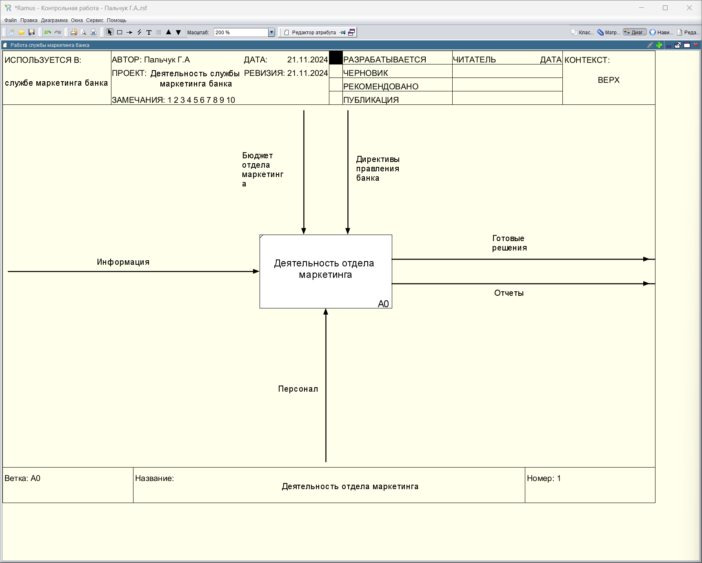
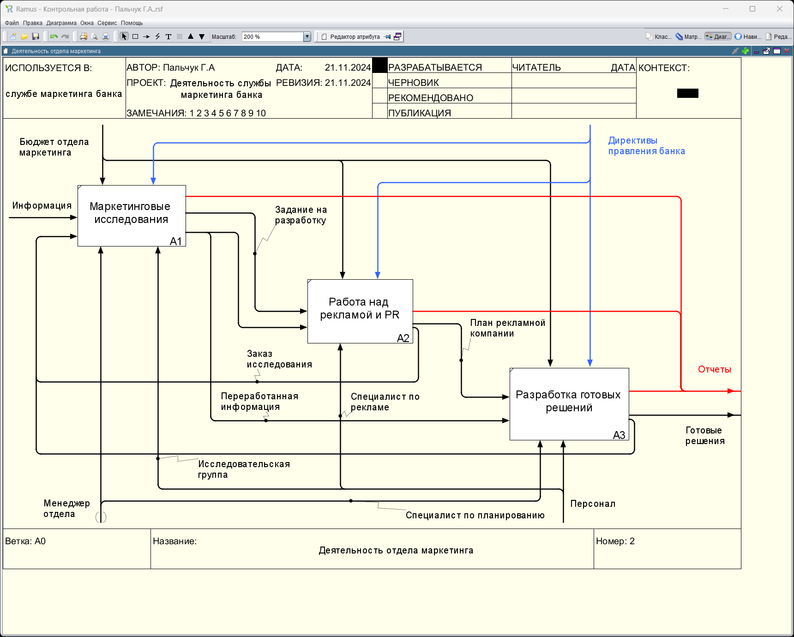
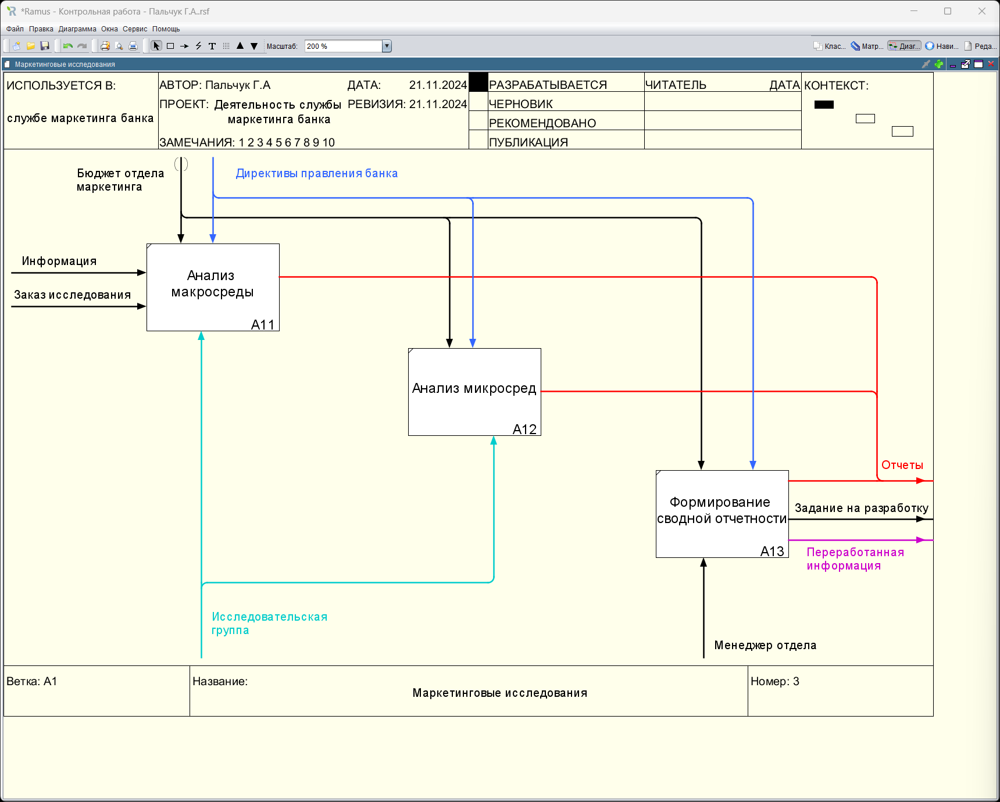
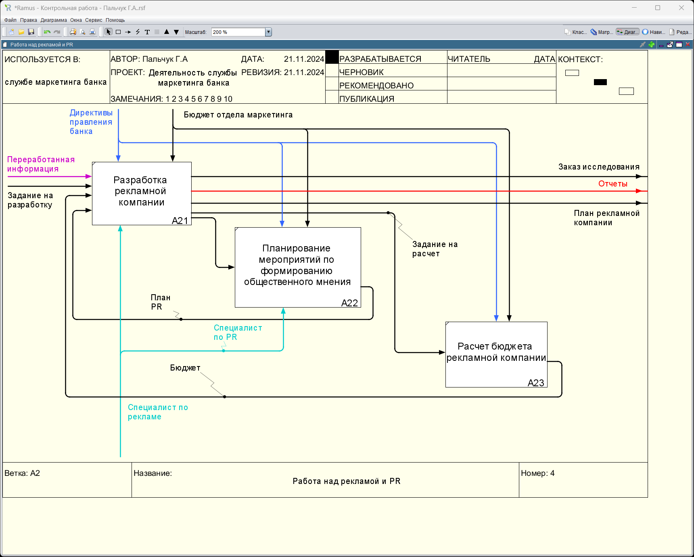
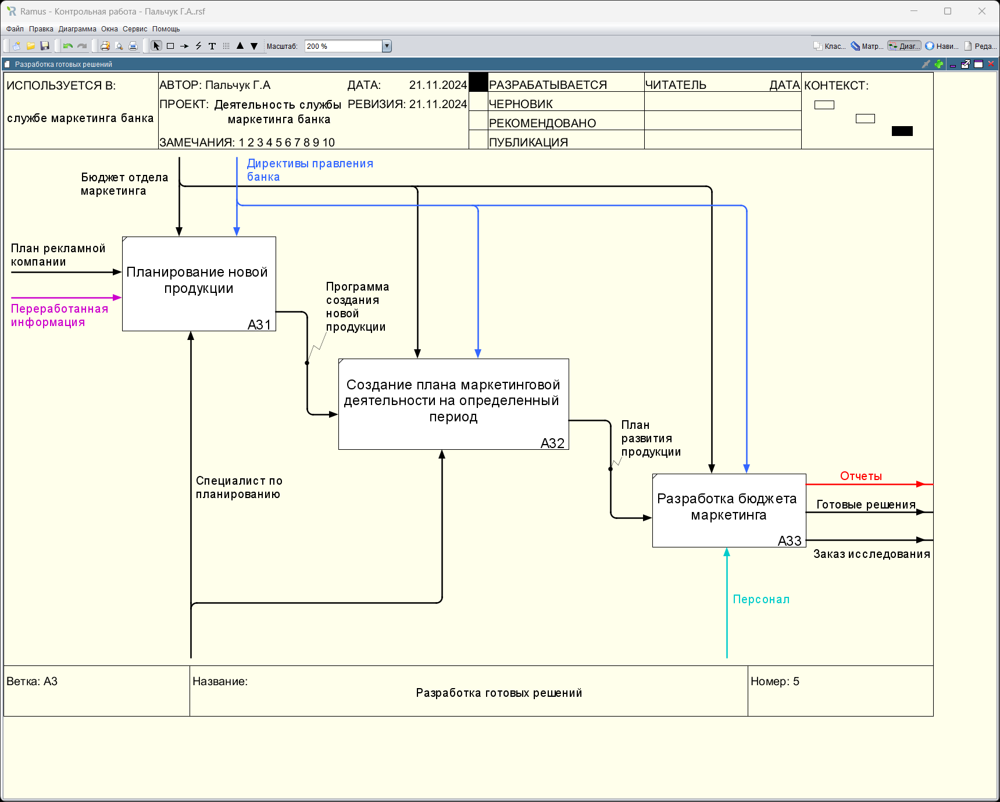
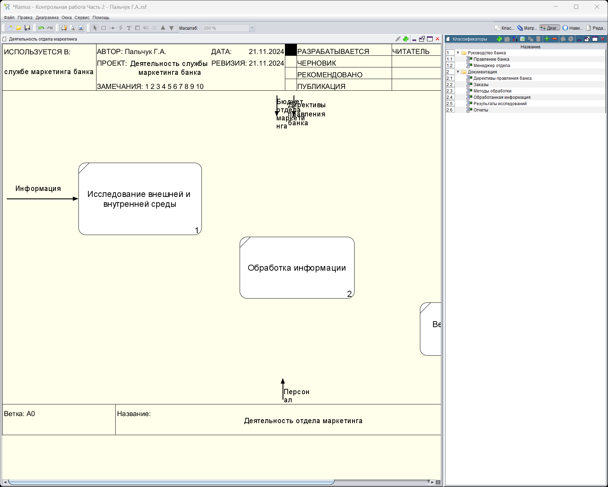
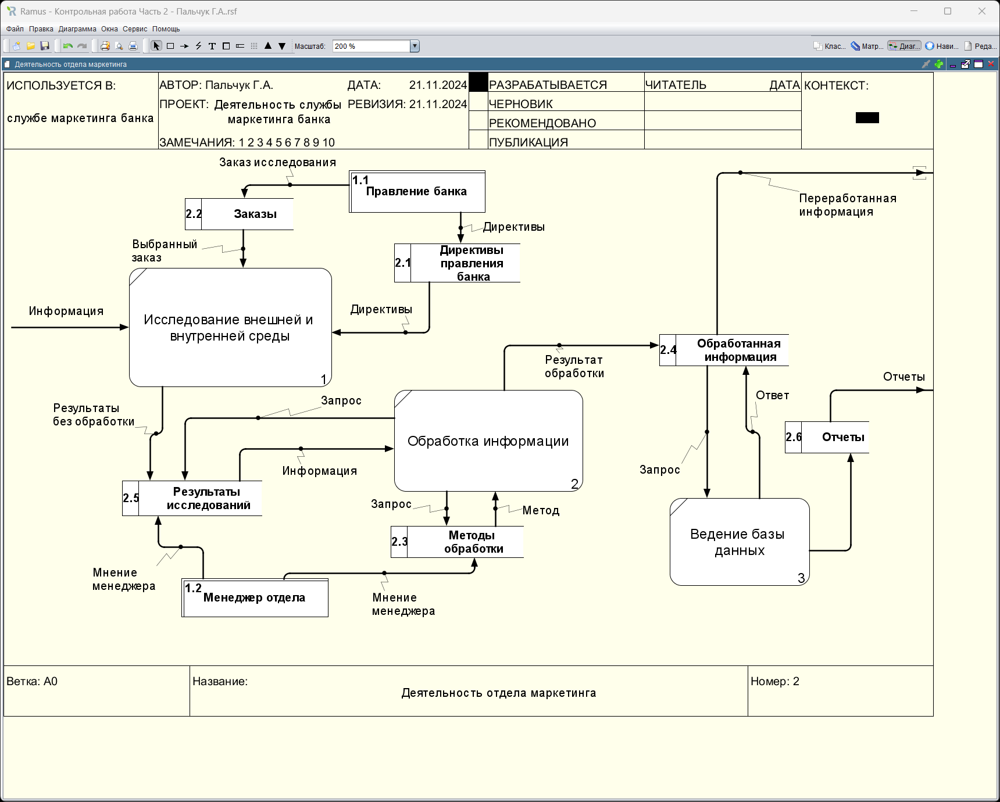

### Пальчук Герман Андреевич, ИВТ 2.1

## Контрольная работа

## Часть №1 «Построение модели «Работа службы маркетинга банка» в нотации IDEF0 в программе Ramus Educational»

#### Ход выполнения:

- Пункты 1-3:

- Задание 4. Диаграмма декомпозиции А0: Работа службы маркетинга:

- Задание 5. Диаграмма декомпозиции А1: Маркетинговые исследования:

- Задание 6. Диаграмма декомпозиции А2: Работа над рекламой и PR:

- Задание 7. Диаграмма декомпозиции А3: Разработка готовых решений:

--- 

## Часть №2. «Создание диаграммы в нотации DFD в модели «Работа службы маркетинга банка» в программе Ramus Educational»

#### Ход выполнения:

- Пункты 1-2:

- Пункт 3:
