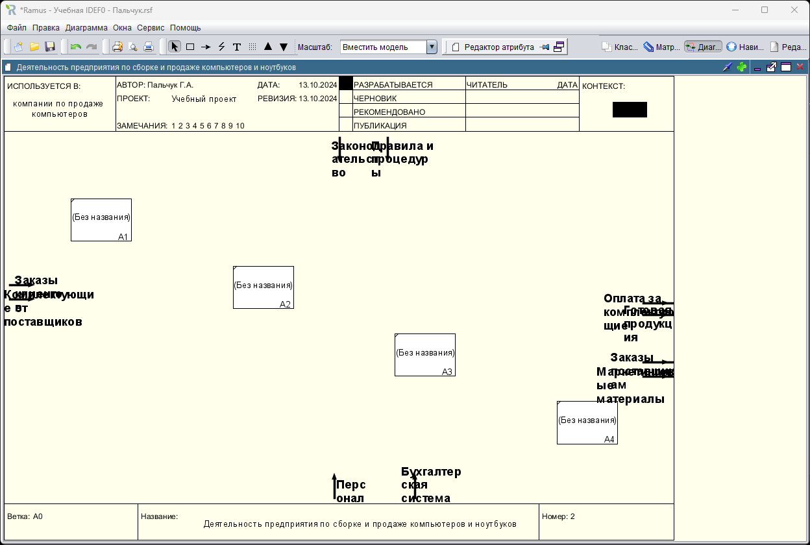
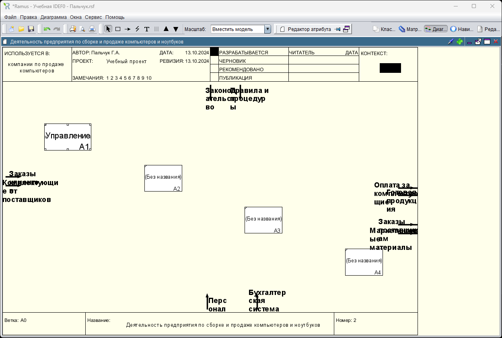
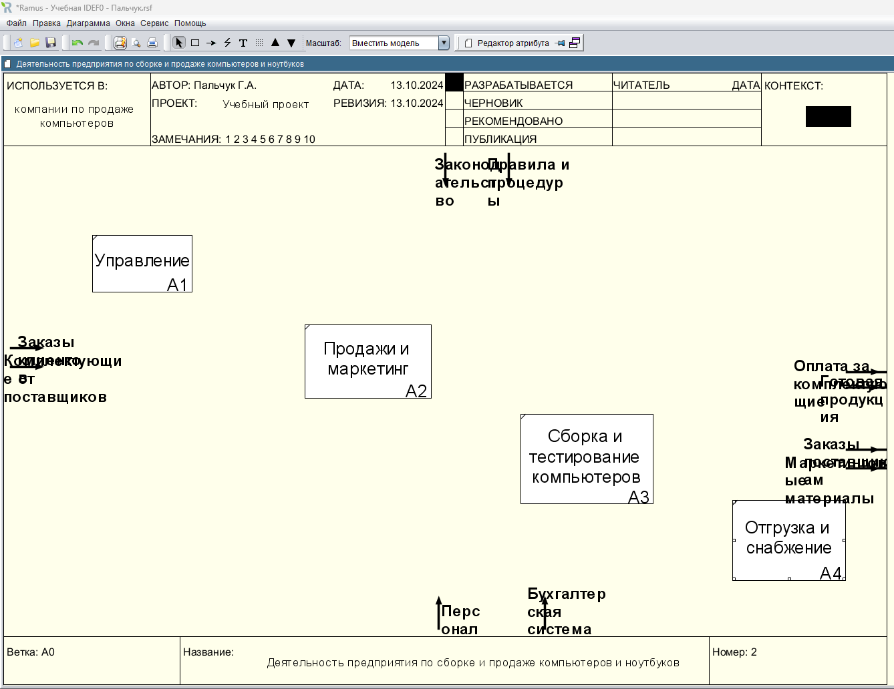
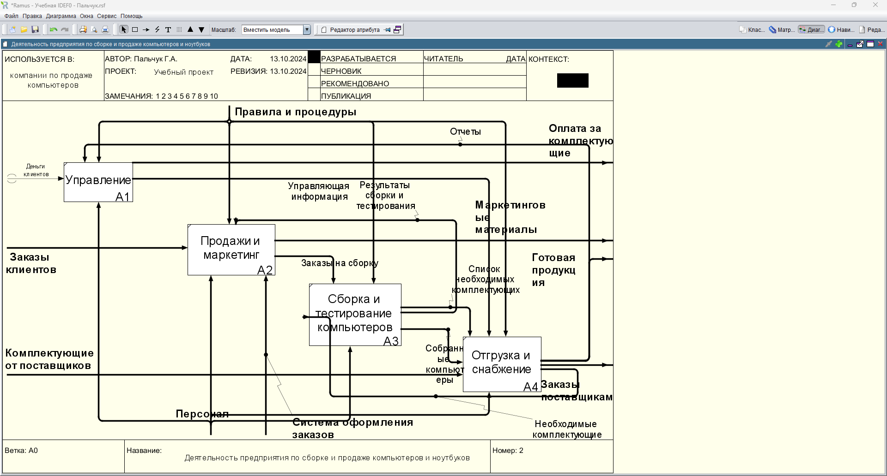
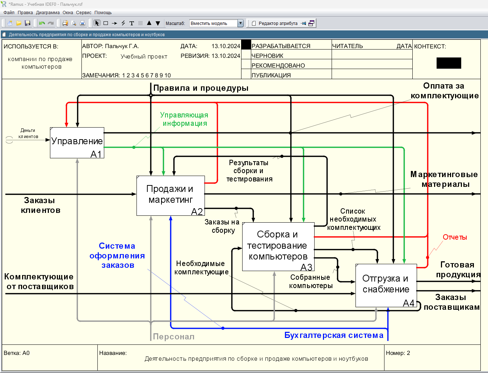

### Пальчук Герман Андреевич, ИВТ 2.1

## Лабораторная работа №3 «Создание диаграммы декомпозиции в нотации IDEF0 в программе Ramus Educational»

#### Ход выполнения:

- Задание 2.1:

- Задания 2.3 - 2.5:

- Задания 2.6 - 2.14:

- Промежуточный результат:

- Итоговый результат:
