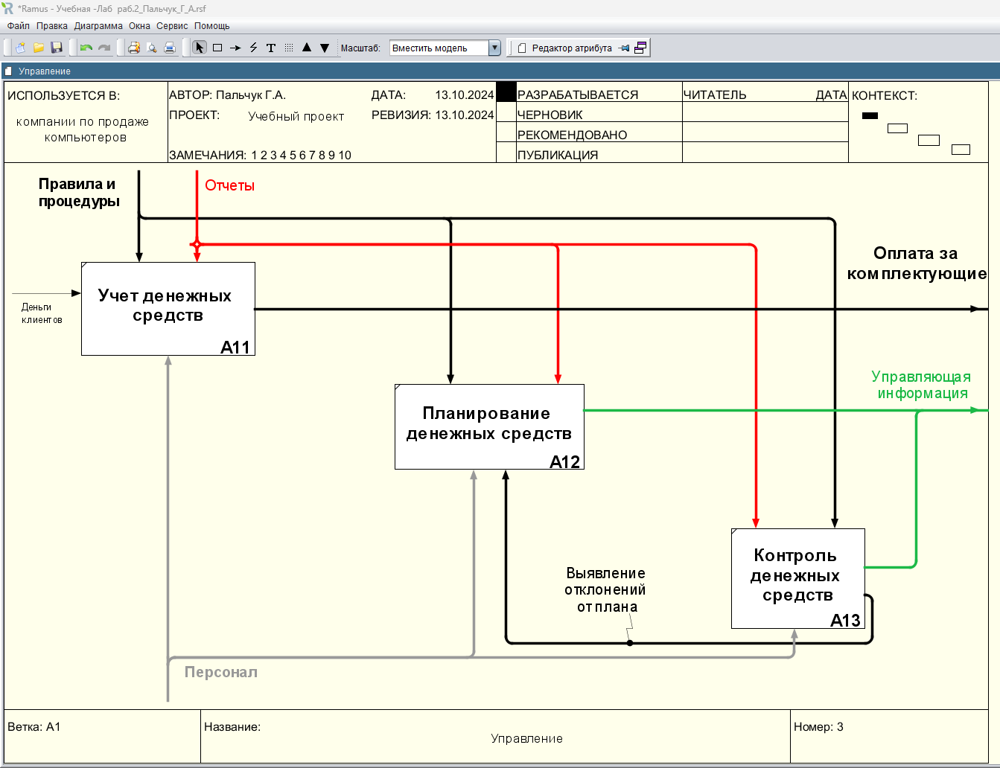

### Пальчук Герман Андреевич, ИВТ 2.1

## Лабораторная работа №4 «Создание диаграмм декомпозиции следующего уровня в нотации IDEF0 в программе Ramus Educational»

#### Ход выполнения:

- Задания 2.1:

- Задание 2.24:

- Продажи и маркетинг:

- Управление:

- Отгрузка и снабжение:
