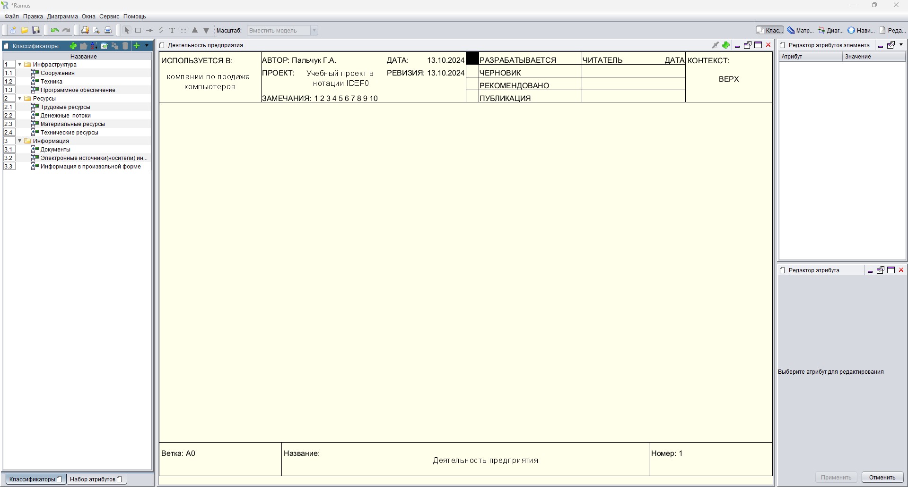
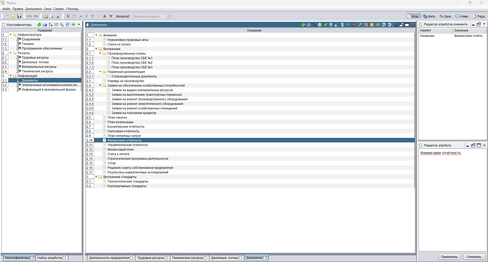
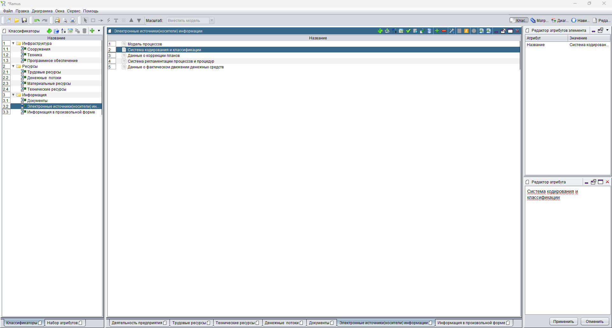
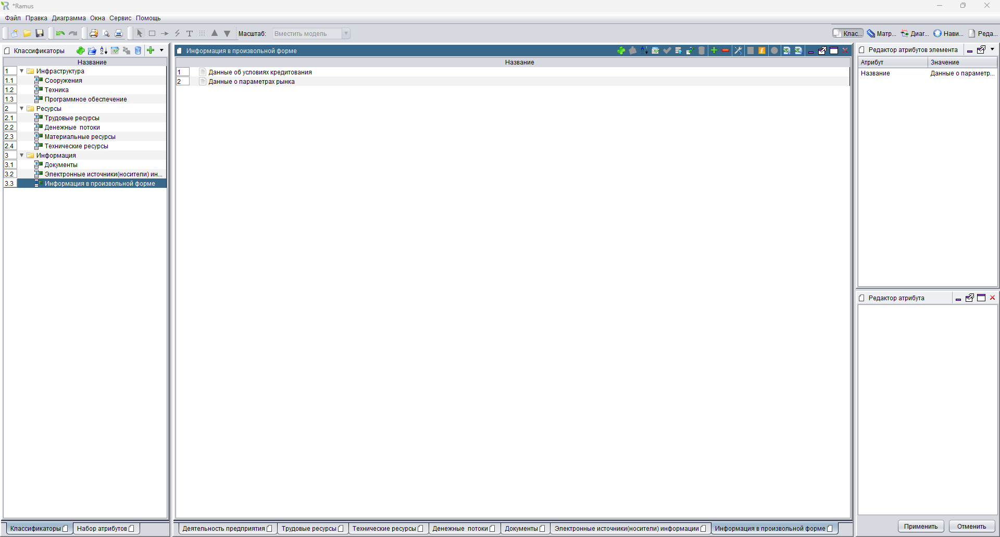

### Пальчук Герман Андреевич, ИВТ 2.1

## Лабораторная работа №5.1 «Создание классификаторов в программе Ramus Educational»

#### Ход выполнения:

- Пункты 1-23:

- Пункт 36:

- Пункт 37:

- Пункт 38:
