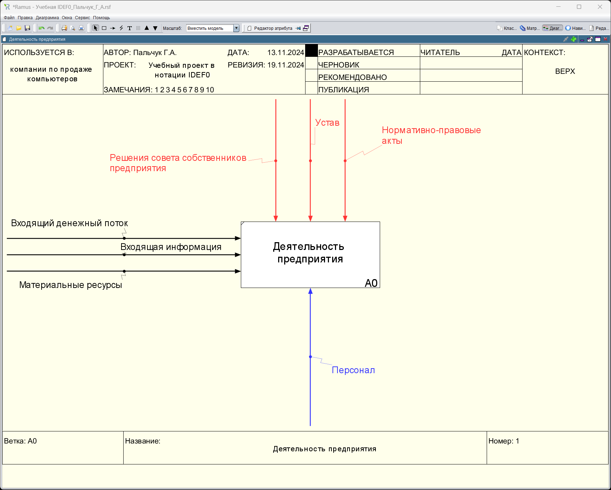
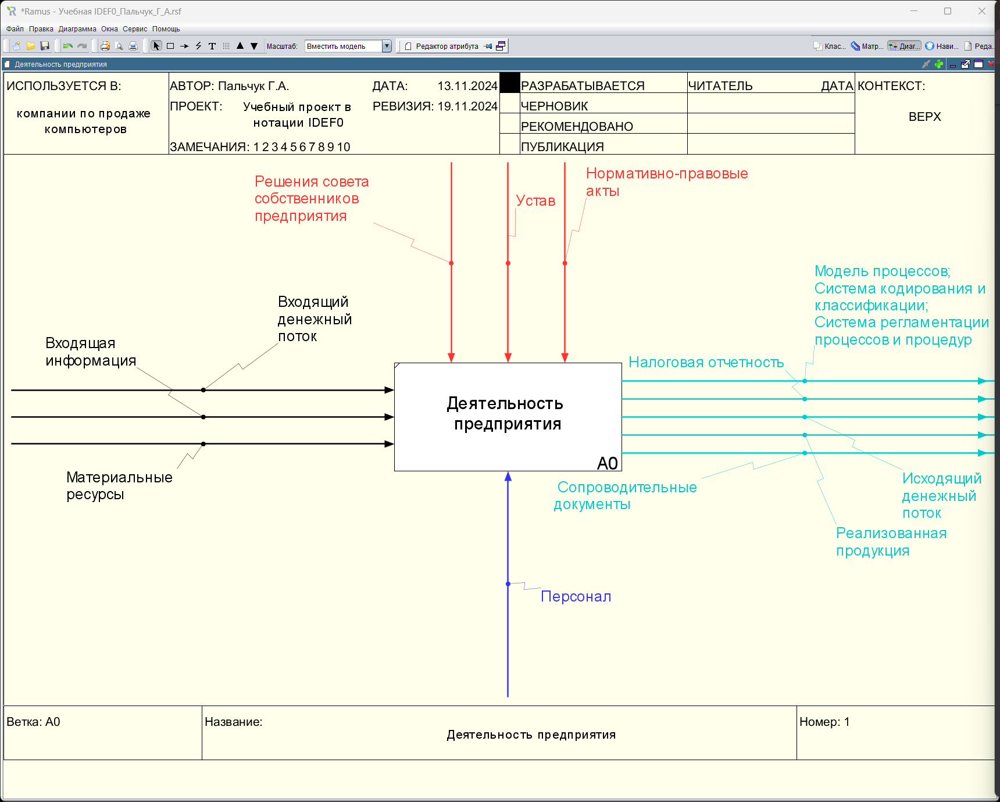
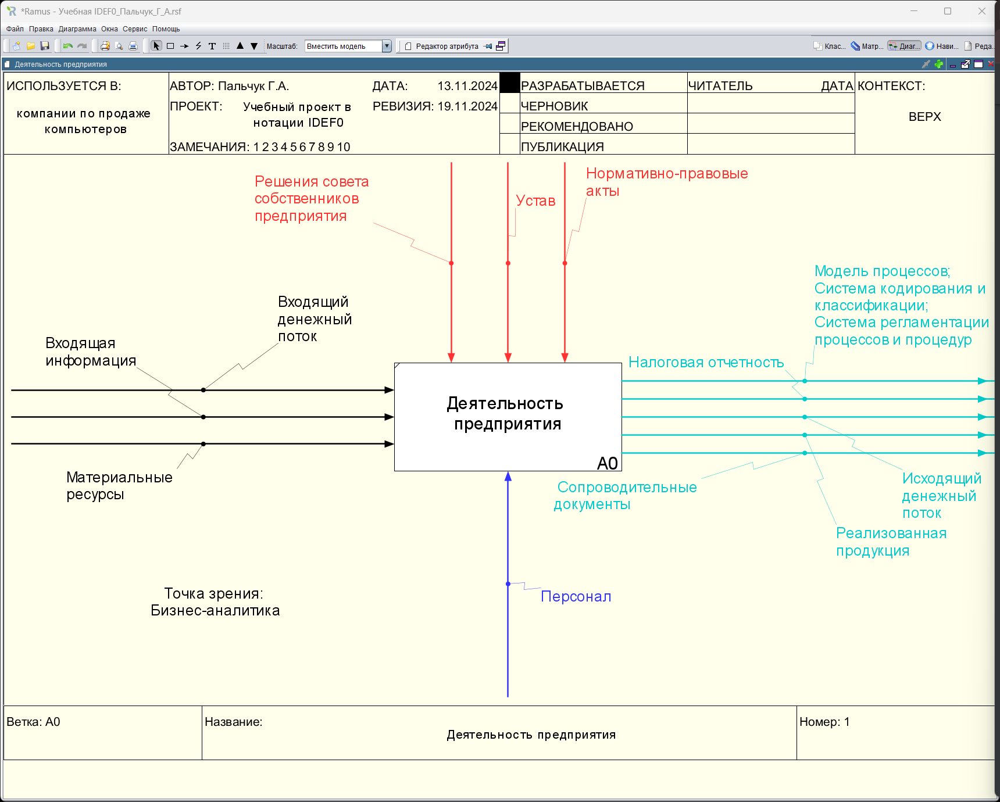

### Пальчук Герман Андреевич, ИВТ 2.1

## Лабораторная работа №5.2 «Создание контекстной диаграммы в нотации IDEF0 с использованием классификаторов в программе Ramus Educational»

#### Ход выполнения:

- Пункты 1-20:

- Пункты 21-31:

- Пункт 32:
