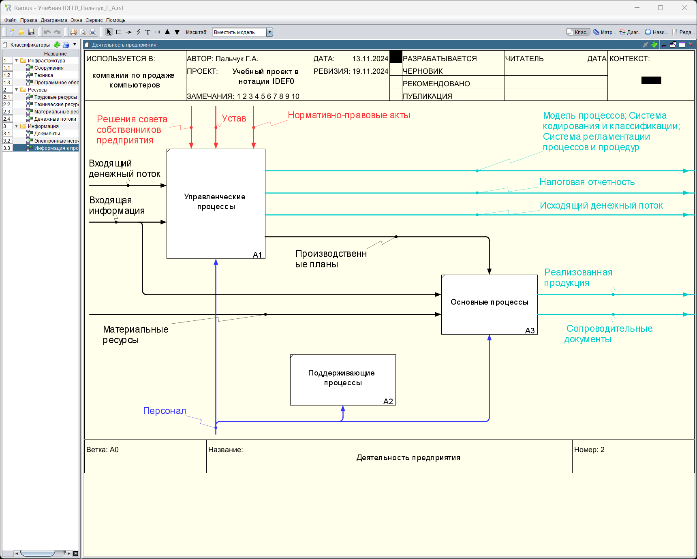
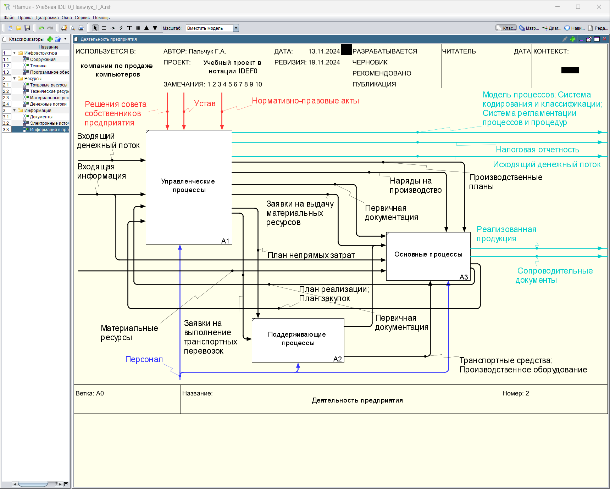

### Пальчук Герман Андреевич, ИВТ 2.1

## Лабораторная работа №6.1 «Создание диаграмм декомпозиции в нотации IDEF0 с использованием классификаторов в программе Ramus Educational»

#### Ход выполнения:

- Пункты 1-3:

- Пункты 4-14:
