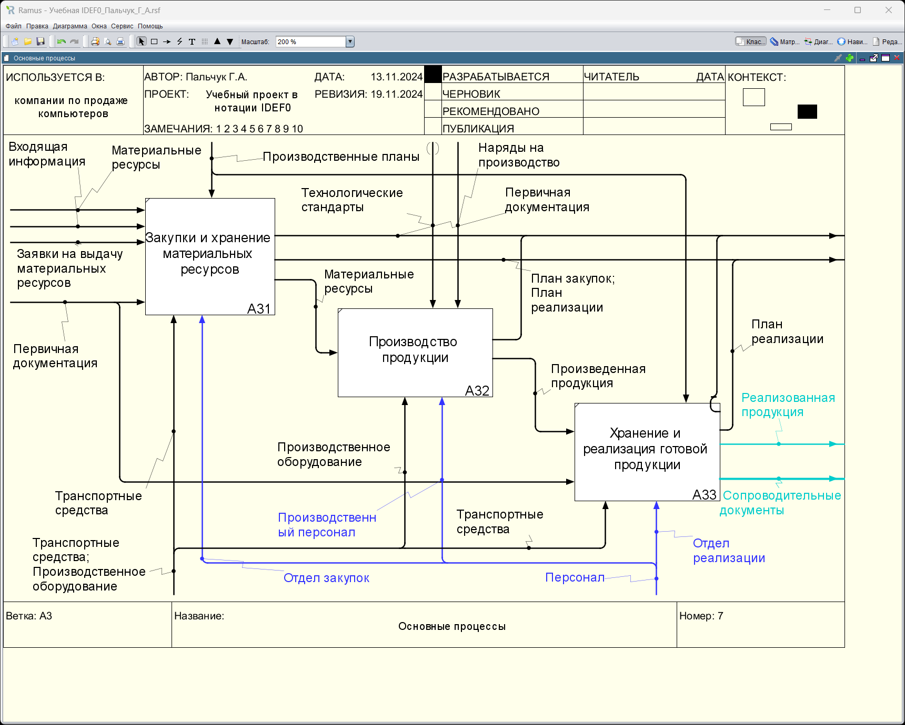

### Пальчук Герман Андреевич, ИВТ 2.1

## Лабораторная работа №6.2 «Создание диаграмм декомпозиции следующих уровней в нотации IDEF0 с использованием классификаторов в Ramus Educational»

#### Ход выполнения:

- Пункт 2. Диаграмма декомпозиции "Управленческие процессы":

- Пункт 3. Диаграмма декомпозиции "Поддерживающие процессы":

- Пункт 4. Диаграмма декомпозиции "Основные процессы":

- Пункт 5. Диаграмма декомпозиции "Процесс стратегического управления":

- Пункт 6. Диаграмма декомпозиции "Процесс тактического управления":
