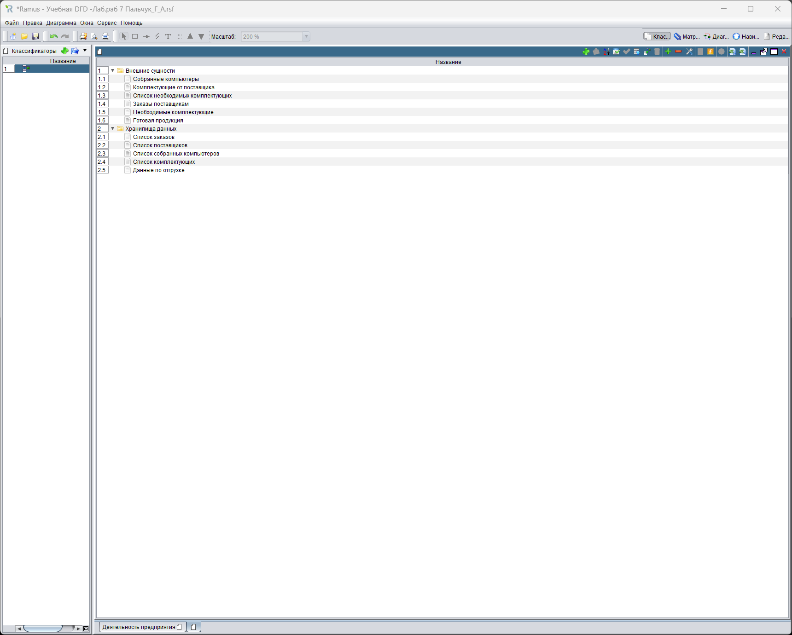
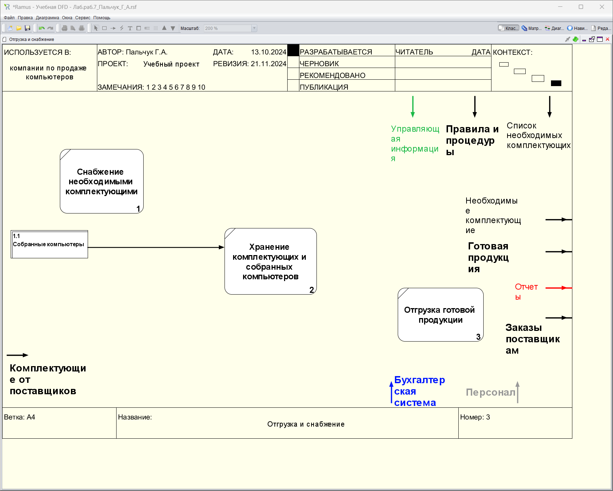
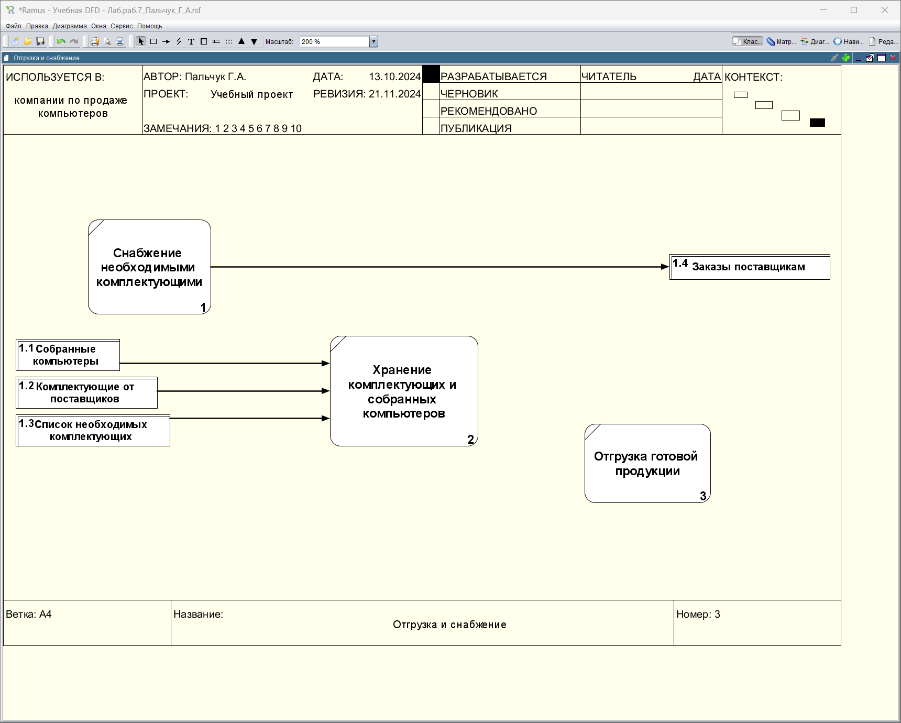
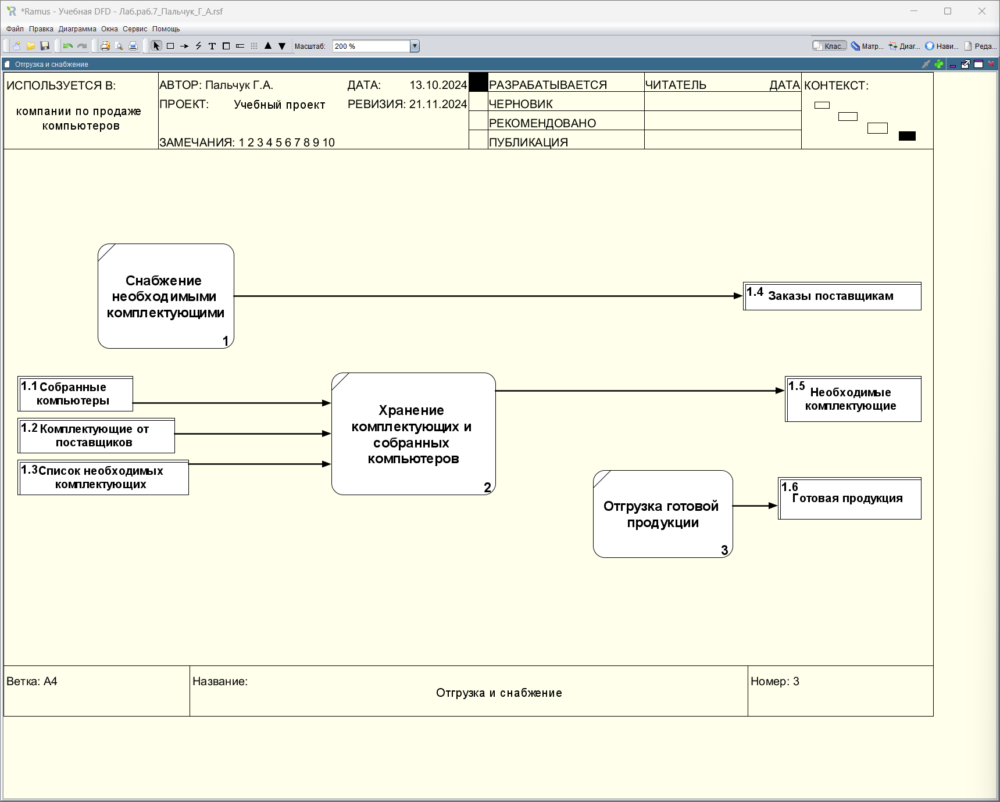
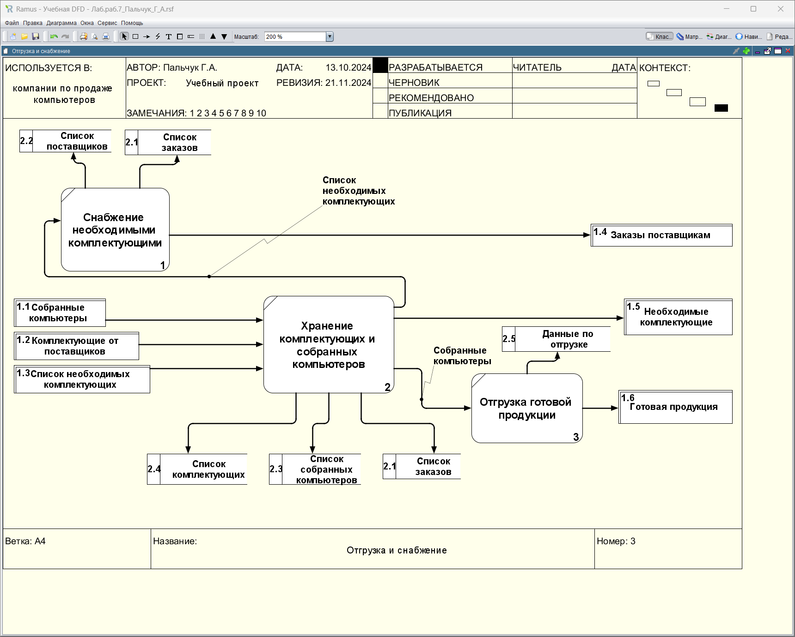
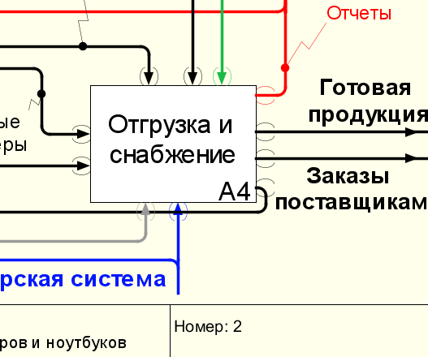

### Пальчук Герман Андреевич, ИВТ 2.1

## Лабораторная работа №7 «Создание диаграммы в нотации DFD в Ramus Educational»

#### Ход выполнения:

- Пункт 3:

- Пункты 4-4.7:

- Пункты 4.8-4.12:

- Пункты 4.12-4.14:

- Пункты 4.14-4.22:

- Пункт 5:
