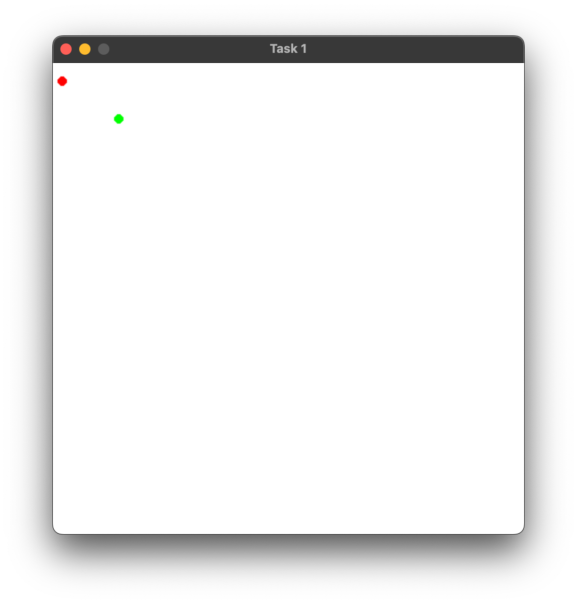
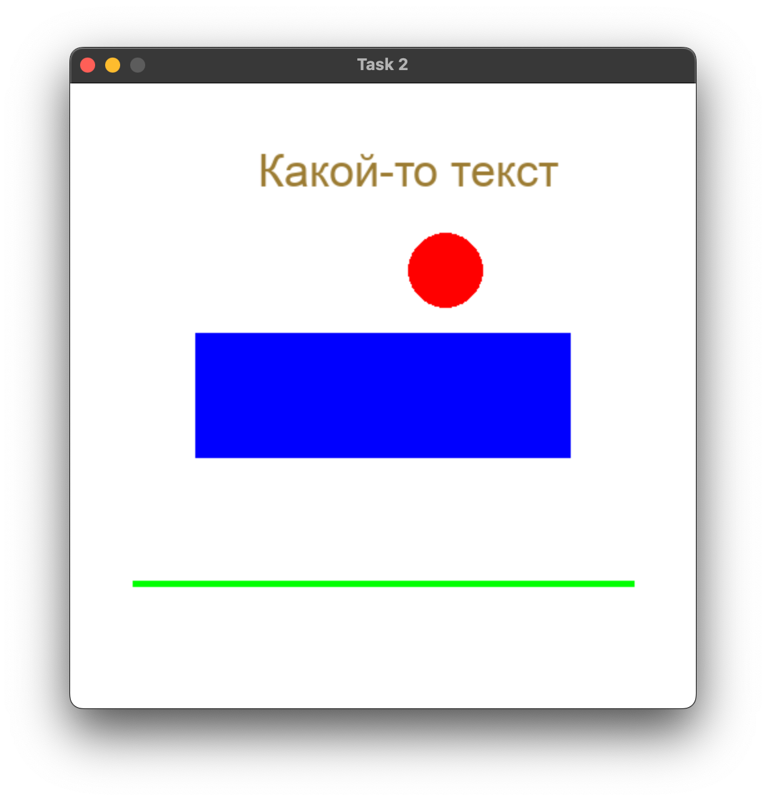
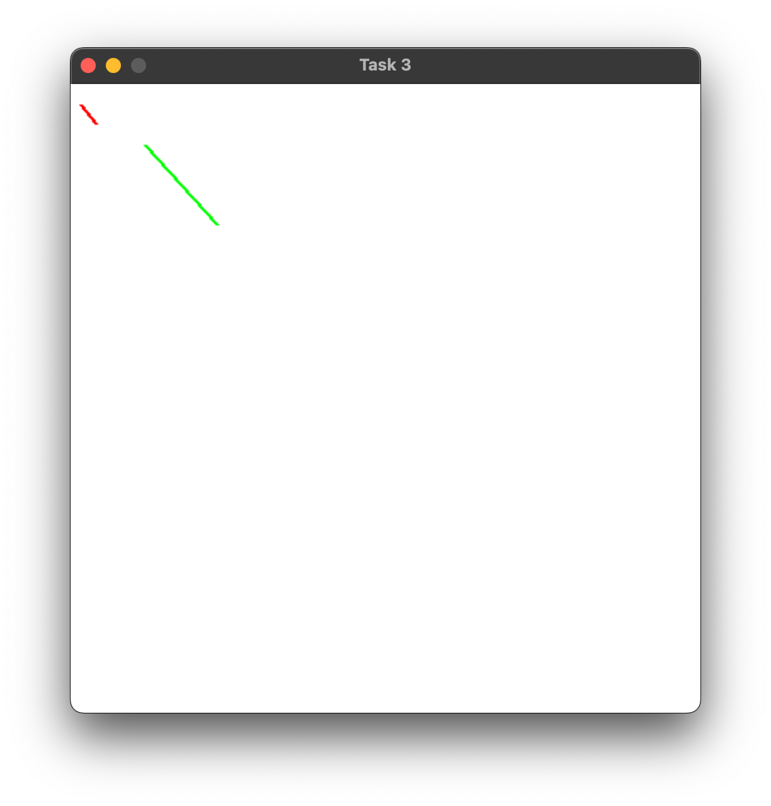

## Практическая работа №1
#### Пальчук Г.А. ИВТ 2.1

### Цель работы:

Работа направлена на прорешивание простых базовых задач с помощью библиотек pygame и numpy.
Только последняя 11-я задача является более объёмной и предполагает элементы ООП.

---

### Задания:

