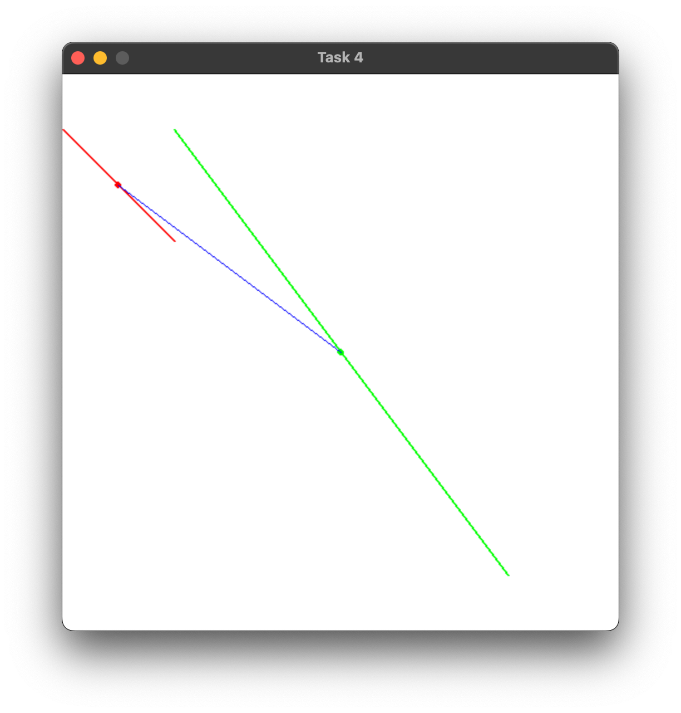
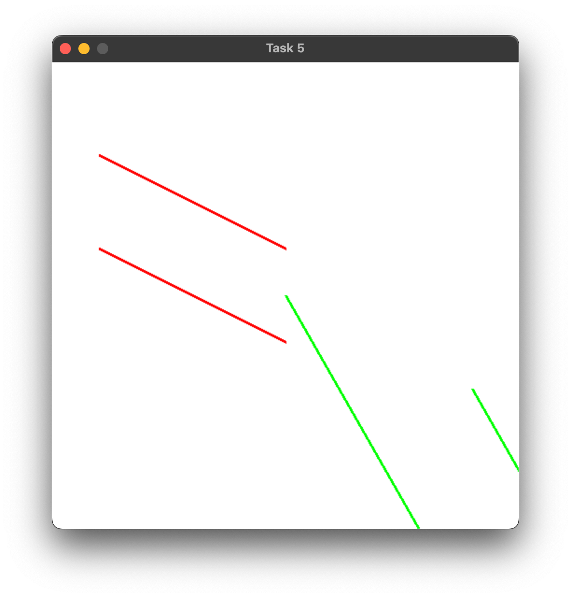
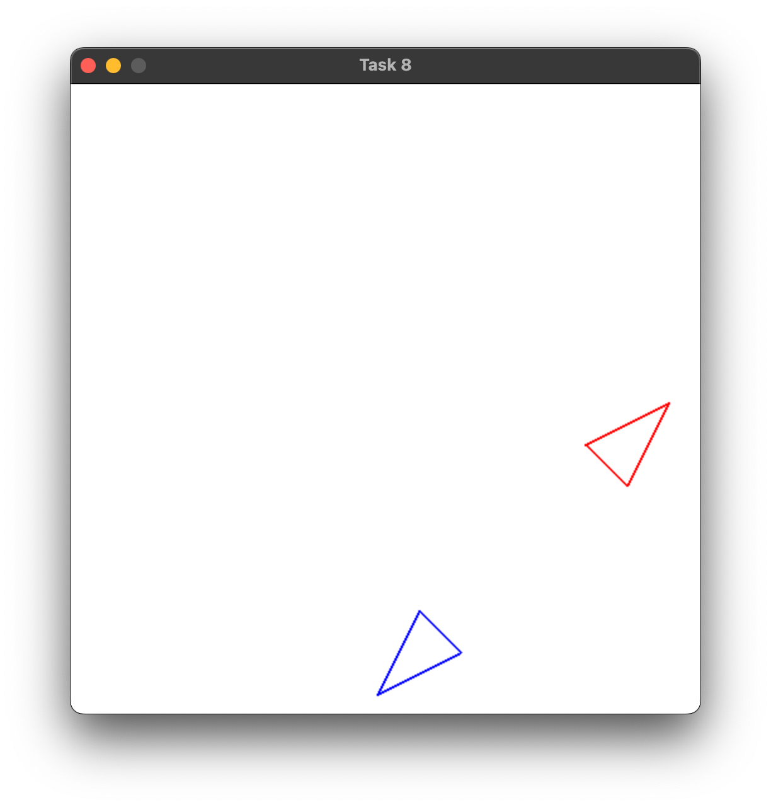
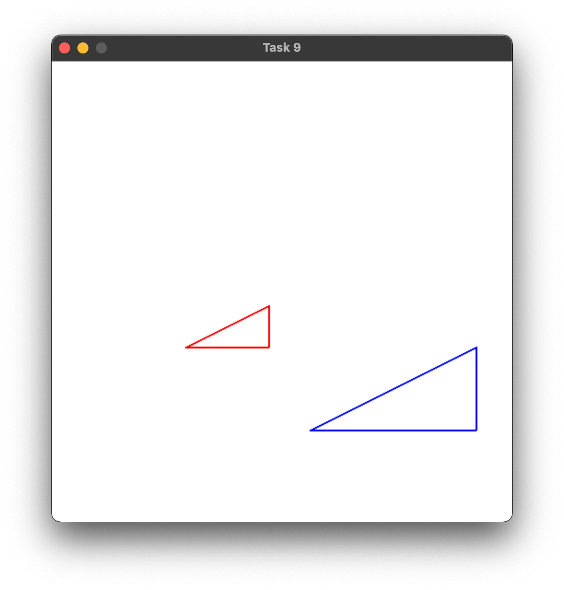
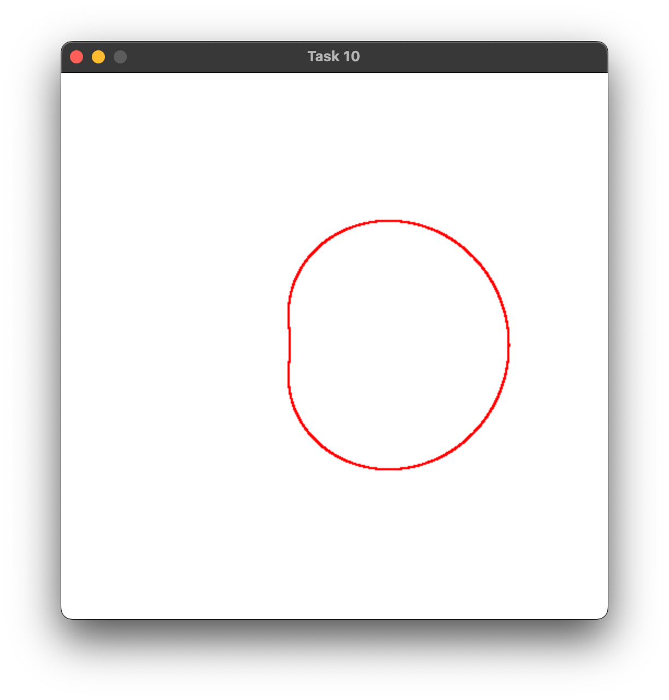

## Практическая работа №1
#### Пальчук Г.А. ИВТ 2.1

### Цель работы:

Работа направлена на прорешивание простых базовых задач с помощью библиотек pygame и numpy.
Только последняя 11-я задача является более объёмной и предполагает элементы ООП.

---

### Задания:
Программа, которая позволяет ввести координаты точки и применить к ним матричное преобразование с матрицей:
  

Графические примитивы (pygame) — окружность, линии, текст — различными цветами в окне программы:
  

Программа, которая преобразует отрезок, заданный двумя точками:
  

Программа для преобразования координат конца отрезка по матрице. Найдите середину исходного и преобразованного отрезка и визуализируйте оба отрезка с помощью pygame. Обозначьте середины отрезков небольшими кругами и соедините их ещё одним отрезком:
  

Преобразуйте два параллельных отрезка, заданных матрицей L, с помощью той же матрицы 𝑇, что и в предыдущей задаче. Рассчитайте и отобразите их начальный и конечный наклоны:
  

 Напишите программу для преобразования пересекающихся отрезков по матрице:
  

Вращение треугольника на 90 градусов против часовой стрелки с помощью матрицы:
  

Отражение треугольника относительно линии y=x с помощью матрицы:
  

Масштабирование треугольника с помощью матрицы:
  

Улитка Паскаля, 𝑟 = 𝑏 + 2 ⋅ 𝑎 ⋅ cos(𝜃):
  
