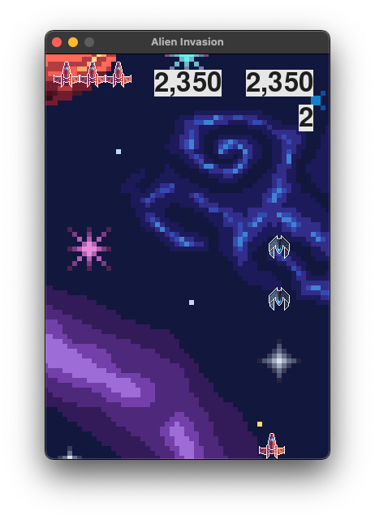

## Практическая работа №2: Базовая 2D-игра «Инопланетное вторжение» с использованием Pygame
#### Пальчук Г.А. ИВТ 2.1

### Цель работы:

Разработать игру «Инопланетное вторжение», в которой игрок управляет кораблём и должен уничтожить флот инопланетян. Работа позволит вам познакомиться с основами разработки игр на Python с помощью библиотеки pygame и
позволит применить эти знания о компьютерной графике, анимации и управлении событиями в дальнейшем.

---

### Итоговый результат

---

### Задания:

1. **Настройка окружения:**
   - Окружение настроено, библиотека pygame установлена.

2. **Создание игрового окна:**
   - Размеры окна были установлены на 350x500 пикселей, фон - кастомное изображение.

3. **Разработка основного цикла игры:**
   - Реализован основной цикл игры. В цикле обрабатываются события, такие как движение корабля, выстрелы и столкновения с инопланетянами.

4. **Создание класса Ship (Корабль):**
   - Создан класс `Ship`. Корабль может двигаться вправо и влево в пределах экрана, его начальная позиция была установлена в центр нижней части экрана.
   - Управление движением корабля осуществляется через события клавиш (стрелки вправо и влево). Координаты корабля обновляются в зависимости от нажатых клавиш.

5. **Добавление стрельбы:**
   - Создан класс `Bullet`, который отвечает за создание снарядов, их движение вверх и удаление при выходе за верхнюю границу экрана.
   - Стрельба осуществляется при нажатии на пробел. Добавлена возможность ограничить количество одновременно выстреленных пуль.

6. **Создание флота инопланетян:**
   - Создан класс `Alien`, который создает инопланетян, движущихся горизонтально и меняющих направление при достижении края экрана.
   - Инопланетяне также постепенно опускаются вниз. 

7. **Добавление конца игры и ограничений:**
   - Добавлена система жизней: при столкновении с инопланетянином или достижении нижней границы игрок теряет один корабль.
   - Когда все жизни заканчиваются, игра завершится.
   - Каждый уровень ускоряет движение инопланетян и увеличивая их количество.

8. **Организация структуры кода:**
   - Код разделён на несколько модулей:
     - `alien_invasion.py` — основной файл игры, в котором запускается игровой цикл.
     - `settings.py` — файл с настройками игры.
     - `ship.py` — класс для создания корабля и управления его движением.
     - `alien.py` — класс для создания инопланетян и их поведения.
     - `bullet.py` — класс для создания снарядов и их движения.
     - `game_stats` — класс для отслеживания статистики.
     - `scoreboard` — класс для вывода игровой информации.
