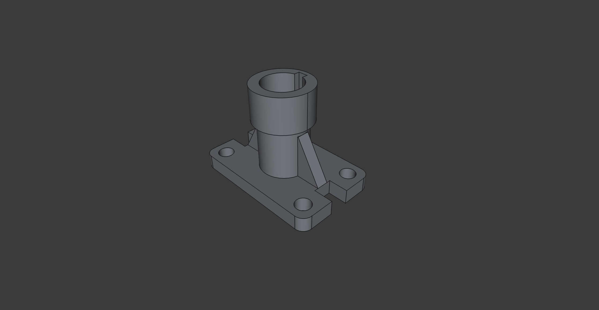
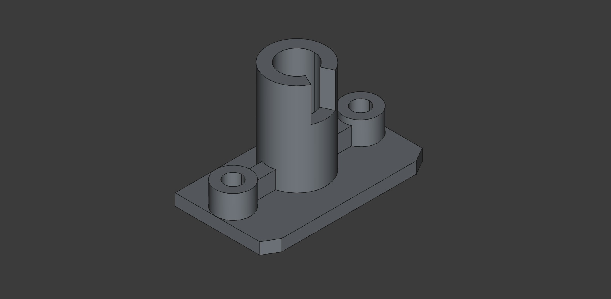
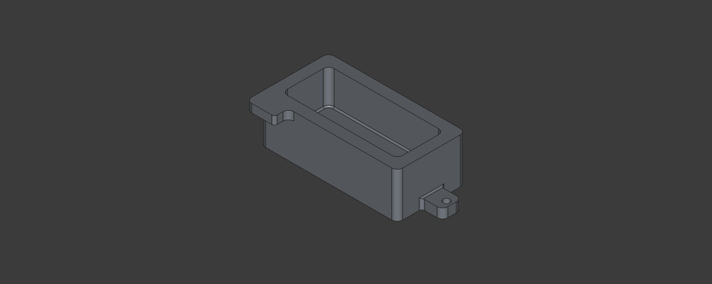
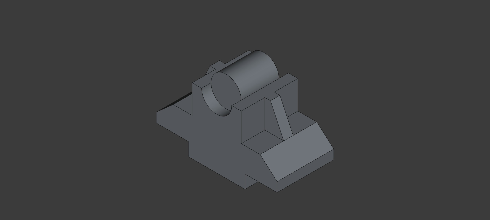

# Задания, выполненные в ходе изучения дисциплины _Инженерная графика_
- Задание 6.1 – создание 6 основных видов для детали
- Задание 6.2 - построение горизонтального, фронтального и профильного разреза, нанесение размерных линий
- Задание 6.3 - построение изометрии детали по двум видам

- Задание 7.2 - создание чертежа в программе **FreeCad**

- Задание 7.3 - построение трех видов и создание 3d модели

- Задание 7.4 - **FreeCad**, 3 вида, прямоугольная изометрия
