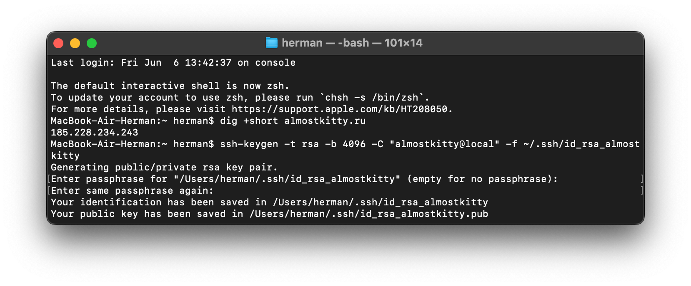
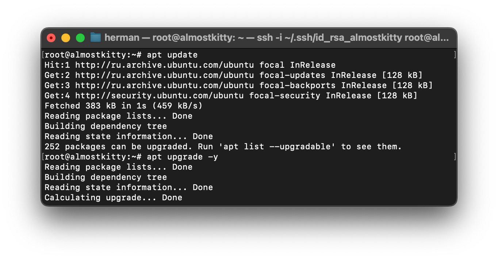
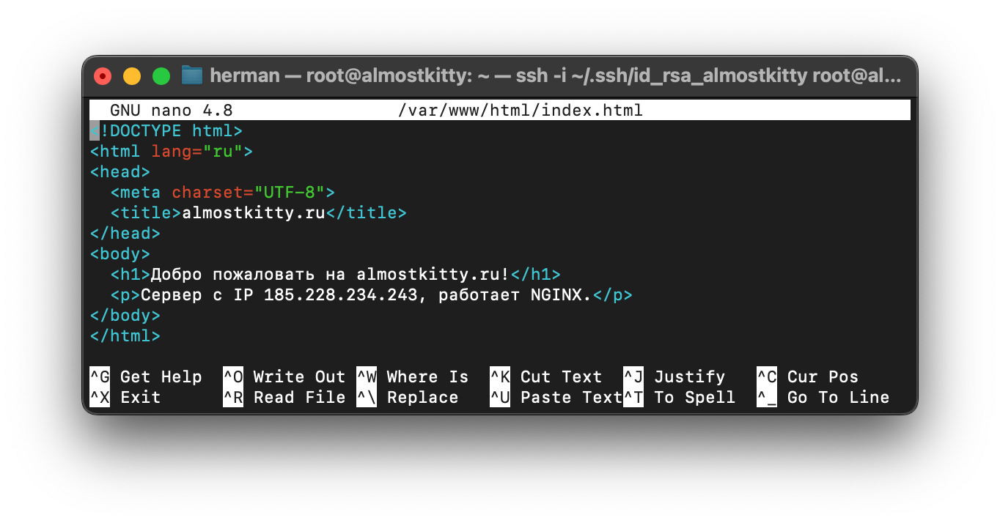
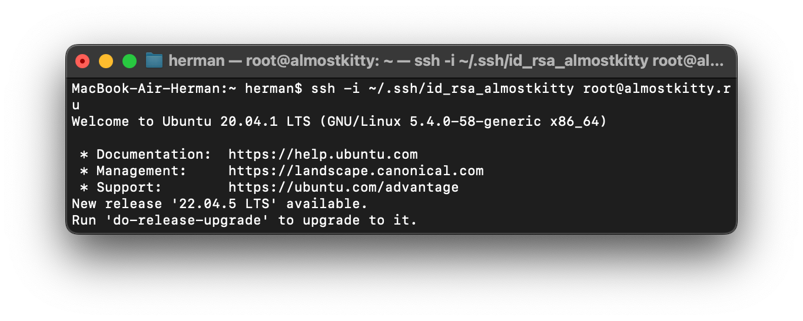
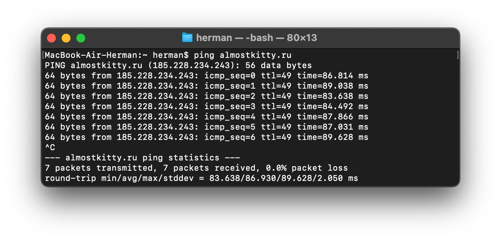
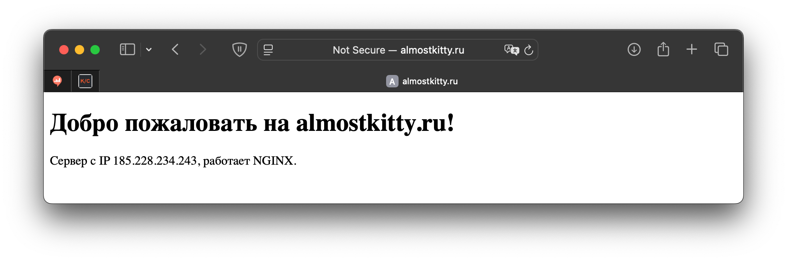

## Создание и настройка VDS, подключение к серверу
#### Пальчук Г.А. ИВТ 2.1

### Ход работы
1. Зарегистрирован домен ```almostkitty.ru```
2. Заказан сервер
3. Генерация пары RSA ключей для подключения через SSH:

4. Актуализация пакетов:

5. Установка NGINX, редактирование стартовой страницы:



### Отчет
1. Подключение через SSH к серверу:

2. Пинг до сервера:

3. Сайт в браузере:

