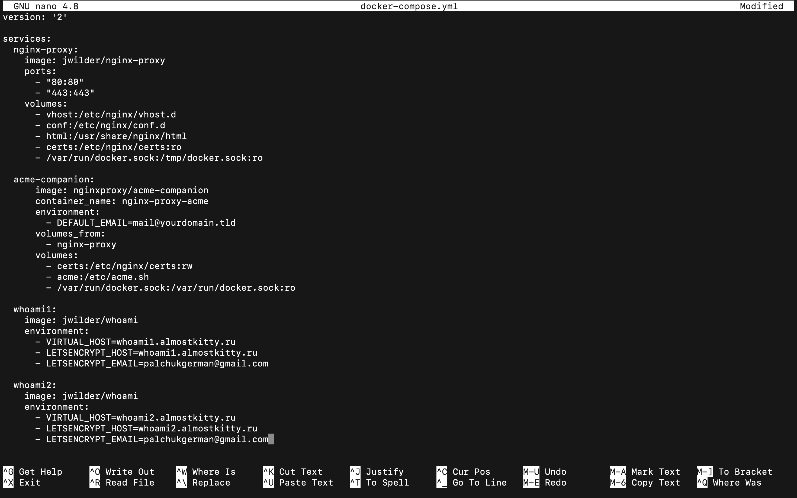
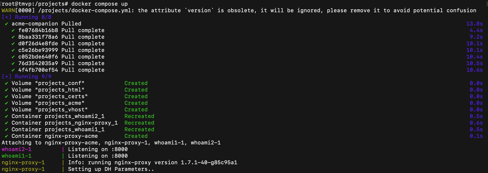
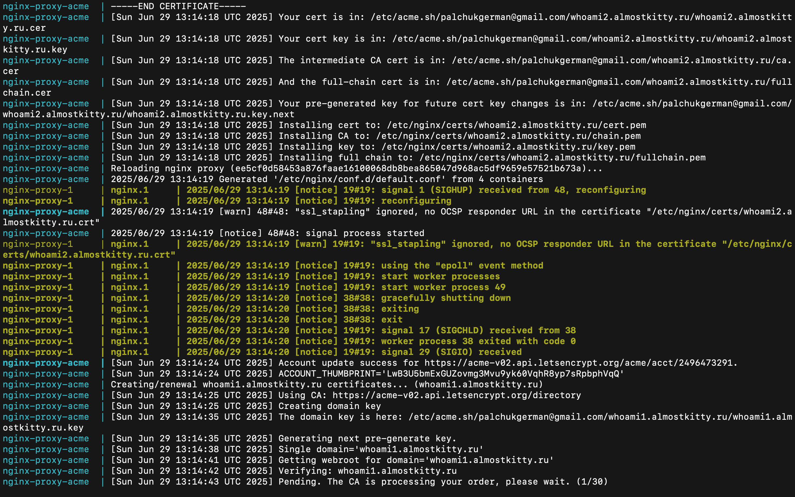

## Отчёт по проделанной работе
#### Пальчук Г.А. ИВТ 2.1

### Развертывание приложений через Docker Compose, с автоматическим выпуском сертификатов  Let's Encrypt
1. Docker Compose, 2 контейнера whoami + контейнер nginx-proxy

2. Запуск

3. Проверка whoami1.almostkitty.ru в браузере. На странице – id контейнера whoami1. Все работает правильно.

4. По примеру из ```acme-companion/docs/Docker-Compose.md```. Добавляю компаньона ```acme-companion``` + указываю версию 2, чтобы убрать ошибку с ```volumes_from```.

5. Запуск

6. Генерация сертификата для whoami2


8. Генерация сертификата для whoami1


9. Проверка в браузере. Соединение безопасное, сертификат есть.

