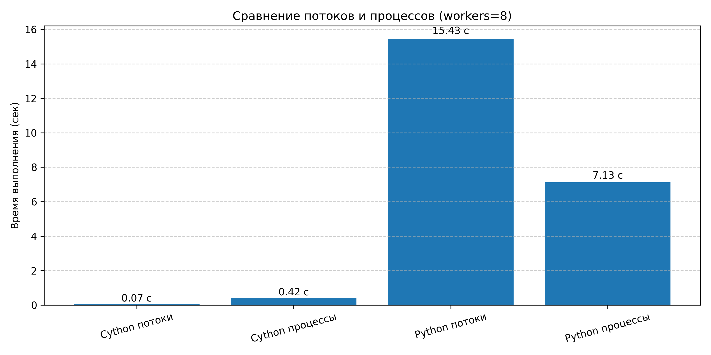

## Лабораторная работа #6
#### Пальчук Г.А. ИВТ 2.1

### Отчёт о проделанной работе

1. ***Шаг 1.***
Переписан исходный код, установлены значения number=2, repeat=3 для теста, построен график, сгенерирован HTML.


2. ***Шаг 2.***
Проведено сравнение реализации с использованием многопоточности ```ThreadPoolExecutor``` и многопроцессности ```ProcessPoolExecutor```. Выполнены замеры времени и построены графики сравнения. Количество вычислителей определялось функцией ```os.cpu_count()``` (возвращающей количество логических ядер процессора).


3. ***Шаг 3.***
Был применён контекстный менеджер with nogil, который освобождает Global Interpreter Lock (GIL) на время длительных вычислений. Сделаны замеры производительности.


### Анализ полученных результов:
| Вариант                | Время, с     |
| ---------------------- | ------------ |
| Cython nogil, потоки   | 8.66 – 8.68  |
| Cython nogil, процессы | 9.08 – 9.17  |
| Python, потоки         | 14.7 – 14.75 |
| Python, процессы       | 7.1 – 7.46   |

- Многопоточность в Cython с nogil показывает существенное ускорение по сравнению с обычным Python в многопоточном режиме — примерно в 1.7 раза быстрее. Это объясняется тем, что освобождение GIL позволяет потокам Cython выполняться параллельно в CPU, в то время как Python-потоки блокируются GIL.
- Многопроцессность в Python даёт лучшее время, чем многопоточность в Python, так как процессы не делят память и GIL, и реально работают параллельно, что хорошо видно по времени — около 7 секунд против 14.7 в потоках.
- Многопроцессность в Cython с nogil показывает немного более высокое время, чем многопоточность в Cython (около 9 секунд против 8.6). Это связано с накладными расходами на создание процессов и межпроцессное взаимодействие, которые иногда могут перевесить выгоду от реального параллелизма для данного объёма задач.