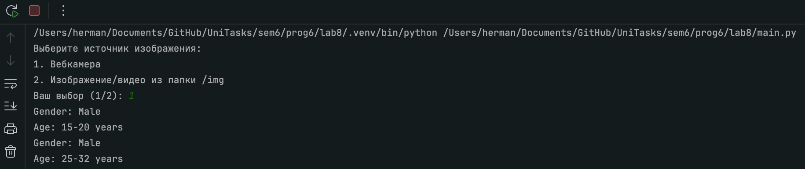
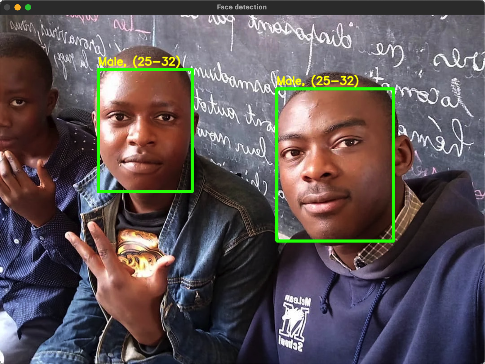

## Лабораторная работа #8
#### Пальчук Г.А. ИВТ 2.1

### Отчёт о проделанной работе

1. ***Функция ```highlightFace```*** написана для определения лиц и отрисовки рамок вокруг них
2. ***Реализован выбор источника потока***. Выбор реализован через терминал

3. ***Реализован функционал по определению пола и возраста***

***Результат для потока с видеокамеры:***


***Результат для изображения:***

