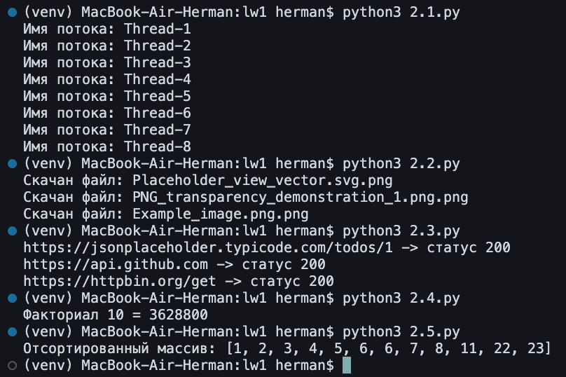
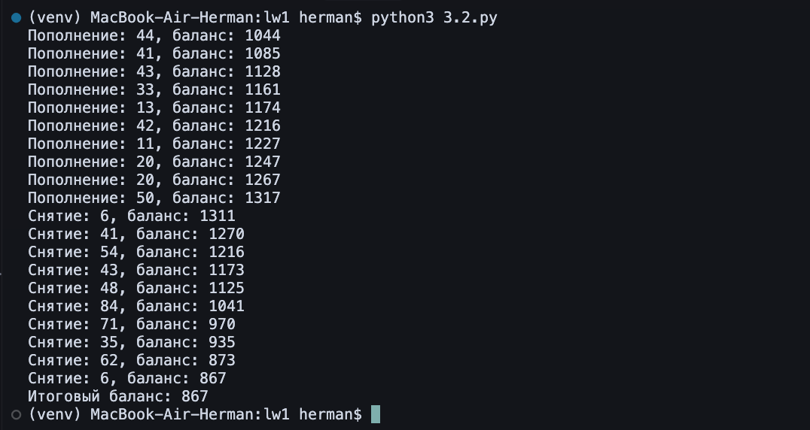
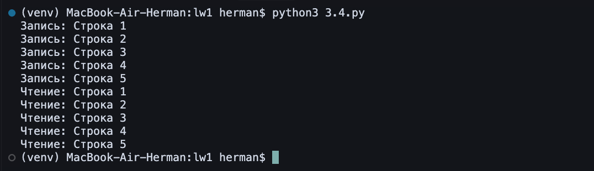
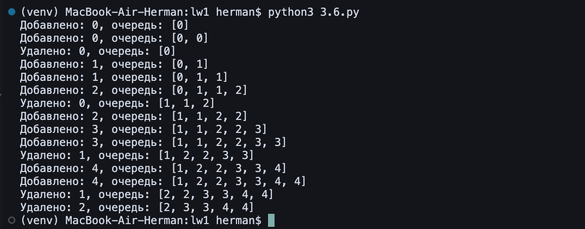
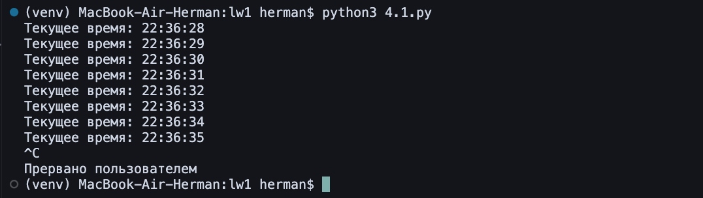
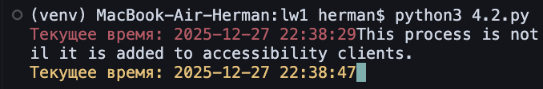
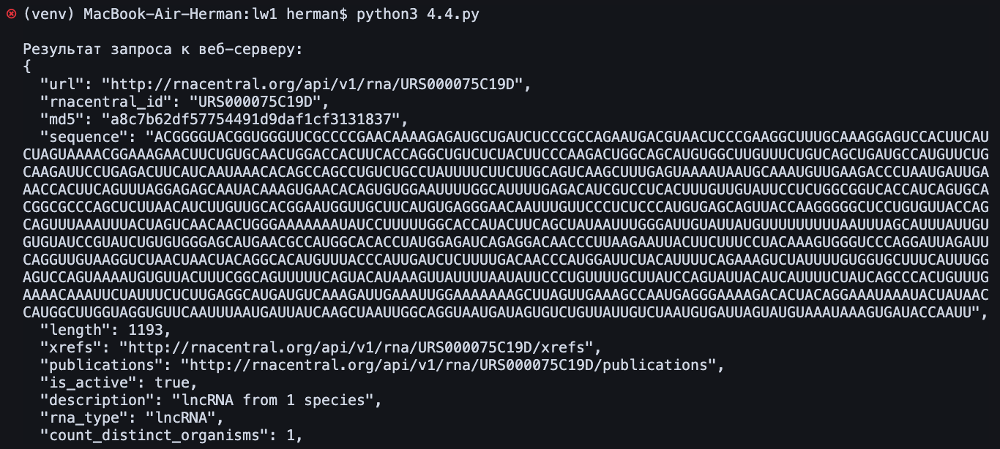
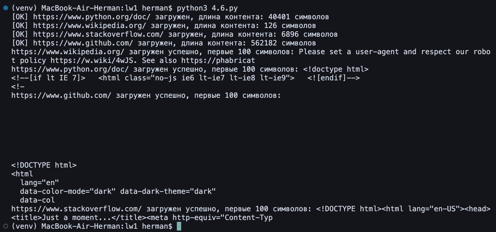

# Лабораторная работа 1

## Пальчук Герман, ИВТ 2.1

## Часть 1. Простое интегрирование
# Лабораторная работа: Численное интегрирование с многопоточностью

## Реализация
- **Последовательное интегрирование:** классический метод прямоугольников и альтернативная реализация через `sum`;
- **Параллельное интегрирование:** разбиение интервала на подинтервалы для потоков, суммирование результатов через `Lock`;

## Результаты
Время выполнения интегрирования функции `sin(x)` на интервале `[0, 1]`:

| n_iter      | Интегрирование | Интегрирование-2 | Параллельное интегрирование |
|------------:|:--------------:|:----------------:|:---------------------------:|
| 10 000 | 0.0064s | 0.0078s | 0.0080s |
| 100 000| 0.0561s | 0.0697s | 0.0619s |
| 1 000 000| 0.5589s | 0.7234s | 0.6149s |

Общее время выполнения полного интегрирования (один запуск с n_iter=100) для проверки работы функций:

- Последовательное интегрирование: 0.4555s
- Последовательное интегрирование-2: 0.8438s
- Параллельное интегрирование: 0.4593s

## Вывод
- Последовательное интегрирование через цикл работает немного быстрее, чем реализация через `sum`.  
- Параллельное интегрирование корректно суммирует результаты через `Lock`, но значительного ускорения не даёт из-за ограничений Python GIL.  
- Время выполнения растёт почти линейно с увеличением числа подинтервалов.

## Часть 2. Потоки в Python
Результат выполнения программ 1 - 5 из части 2:

## Часть 3. Concurrency и Futures
Задание 1: Дополнение первой задачи

Задание 2: Симулирование снятия денег со счета

Задание 3: Реализовано асинхронное скачивание изображений из Википедии, использован семафор

Задание 4: Создан файл data.txt, реализовано два потока

Задание 5: 

Задание 6: 

Задание 7: 

Задание 8: Дополнительно создана функция, создающая новую диркторию и наполняющую ее TXT-файлами

## Часть 4. Асинхронность
Задание 1:

Задание 2: Улучшение предыдущей программы

Задание 3:

Задание 4: Произошла ошибка из-за отсутствия SSl-сертификата.

Задание 5:

Задание 6:
