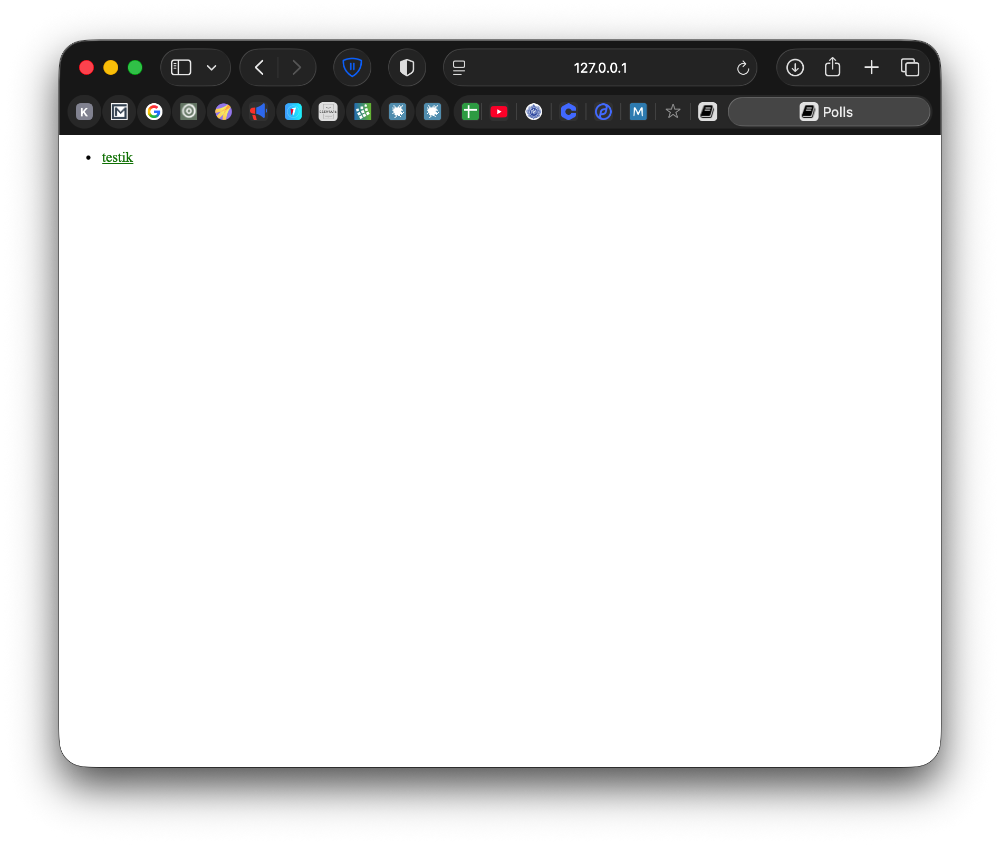

# Лабораторная работа #3. Введение в Django
## Пальчук Герман, ИВТ 2.1

Выполнены все 7 частей туториала Django 5.1 по ссылке: https://docs.djangoproject.com/en/5.1/#first-steps

## Часть 1: Запросы и ответы

**Выполнено:**
- Создан проект Django с помощью команды `django-admin startproject mysite .`
- Создано приложение polls с помощью команды `python manage.py startapp polls`
- Добавлено приложение polls в INSTALLED_APPS в settings.py
- Создана первая view функция `index()` в polls/views.py, возвращающая простой HTTP ответ
- Создан файл polls/urls.py для маршрутизации URL приложения
- Подключено приложение polls в основной файл urls.py проекта через include()

## Часть 2: Модели и административный сайт

**Выполнено:**
- Созданы модели Question и Choice в polls/models.py:
  - Question: question_text (CharField), pub_date (DateTimeField)
  - Choice: question (ForeignKey), choice_text (CharField), votes (IntegerField)
- Зарегистрирована модель Question в polls/admin.py
- Выполнены команды makemigrations и migrate для создания и применения миграций базы данных

## Часть 3: Представления и шаблоны

**Выполнено:**
- Созданы дополнительные views: detail(), results(), vote()
- Создана директория polls/templates/polls/ для шаблонов
- Созданы HTML шаблоны:
  - index.html - список последних 5 вопросов
  - detail.html - детальный вид вопроса с вариантами ответов
- Обновлены URL patterns в polls/urls.py для всех views
- Добавлен app_name = "polls" для namespace

## Часть 4: Формы и обобщенные представления

**Выполнено:**
- Переписаны views на использование generic views (ListView, DetailView)
- Создан класс IndexView на основе generic.ListView
- Создан класс DetailView на основе generic.DetailView
- Создан класс ResultsView на основе generic.DetailView
- Реализована функция vote() для обработки POST запросов при голосовании
- Обновлен шаблон detail.html для отображения формы с radio buttons
- Создан шаблон results.html для отображения результатов голосования
- Обновлены URL patterns для использования .as_view() метода

## Часть 5: Тестирование

**Выполнено:**
- Созданы тесты для модели Question:
- Добавлен метод was_published_recently() в модель Question
- Созданы тесты для IndexView:
- Созданы тесты для DetailView:
- Обновлены views для фильтрации будущих вопросов через get_queryset()
- Все тесты успешно проходят (10 тестов)

## Часть 6: Статические файлы

**Выполнено:**
- Создана директория polls/static/polls/ для статических файлов
- Создан файл style.css с базовыми стилями
- Добавлен тег  в шаблон index.html
- Подключен CSS файл через тег 
- Создана директория polls/static/polls/images/ для фоновых изображений (опционально)

## Часть 7: Настройка административного сайта

**Выполнено:**
- Создан класс QuestionAdmin для кастомизации административной панели
- Настроены fieldsets для группировки полей (question_text и pub_date)
- Добавлен класс ChoiceInline (TabularInline) для редактирования Choice внутри Question
- Настроен list_display для отображения question_text, pub_date, was_published_recently в списке
- Добавлен list_filter для фильтрации по дате публикации
- Добавлен search_fields для поиска по тексту вопроса

## Основные компоненты

- **Модели**: Question (вопросы) и Choice (варианты ответов)
- **Views**: IndexView, DetailView, ResultsView (generic views) и vote() (function view)
- **Templates**: index.html, detail.html, results.html
- **URLs**: Маршрутизация через polls/urls.py с namespace "polls"
- **Admin**: Полностью настроенная административная панель
- **Tests**: Полное покрытие тестами (10 тестов)
