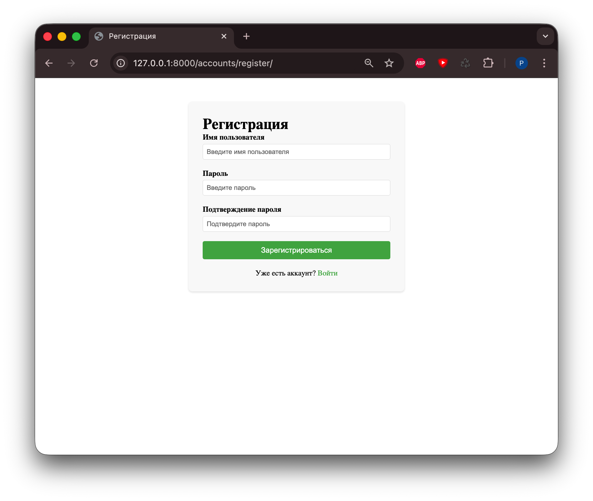
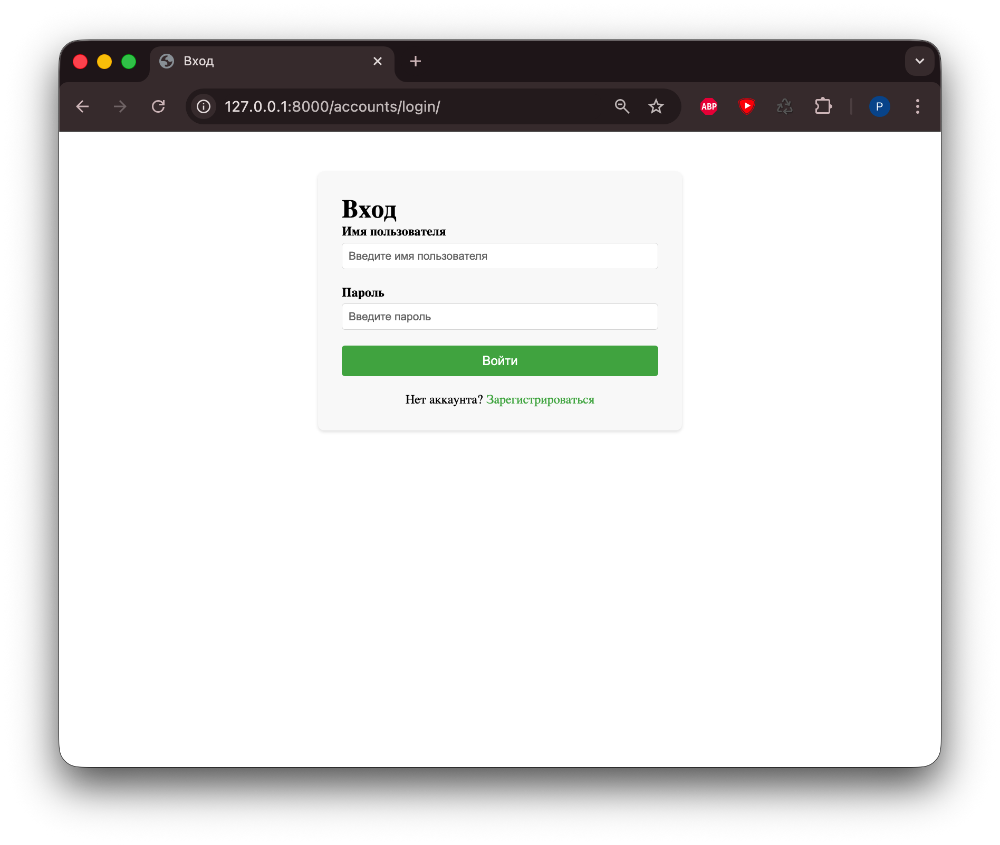
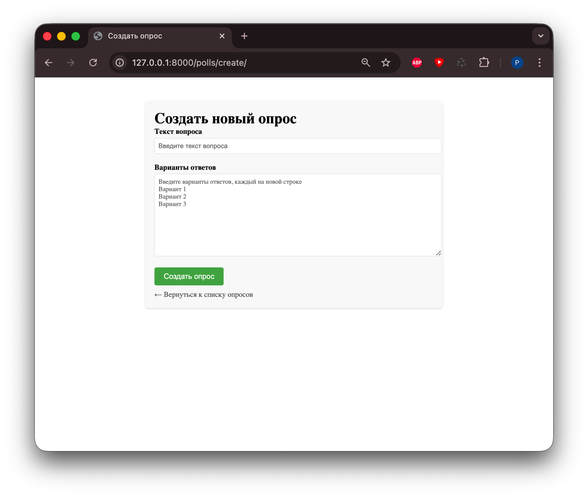

# Лабораторная работа №5. Работа с формами. Аутентификация и регистрация пользователей

## Пальчук Герман, ИВТ 2.1

---

## Часть 1.1: Форма для создания новых опросов

### Выполнено:

1. **Создан файл `polls/forms.py`** с формой `QuestionForm`
2. **Добавлена view функция `create_question`** в `polls/views.py`
3. **Создан шаблон `polls/templates/polls/create_question.html`**
4. **Добавлен URL маршрут** `/polls/create/` в `polls/urls.py`
5. **Обновлена главная страница** (`polls/templates/polls/index.html`):

---

## Часть 1.2: Аутентификация и регистрация пользователей

### Выполнено:

1. **Создано приложение `accounts`**
2. **Реализована регистрация пользователей** (`accounts/views.py`)
3. **Реализована аутентификация (login/logout)**
4. **Созданы шаблоны**
5. **Обновлена навигация**

### Формы Django:
- Использован `forms.ModelForm` для создания формы на основе модели Question
- Дополнительное поле `choices_text` для ввода вариантов ответов через Textarea
- Валидация данных на стороне сервера
- Отображение ошибок валидации в шаблонах

### Аутентификация Django:
- Использована встроенная система аутентификации Django (`django.contrib.auth`)
- `UserCreationForm` для регистрации пользователей
- `LoginView` и `LogoutView` для входа и выхода
- Декоратор `@login_required` для защиты представлений
- Система сообщений Django для уведомлений пользователей

### Безопасность:
- CSRF защита через ``
- Хеширование паролей (встроенное в Django)
- Валидация паролей через `AUTH_PASSWORD_VALIDATORS`
- Ограничение доступа к созданию опросов только для авторизованных пользователей

## Итог:

1. Успешно реализована форма для создания новых опросов с удобным интерфейсом
2. Добавлена полная система аутентификации и регистрации пользователей
3. Обеспечена безопасность через CSRF защиту и ограничение доступа
4. Улучшен пользовательский интерфейс всех страниц приложения
5. Интегрирована система сообщений для уведомлений пользователей

## Скриншоты:

