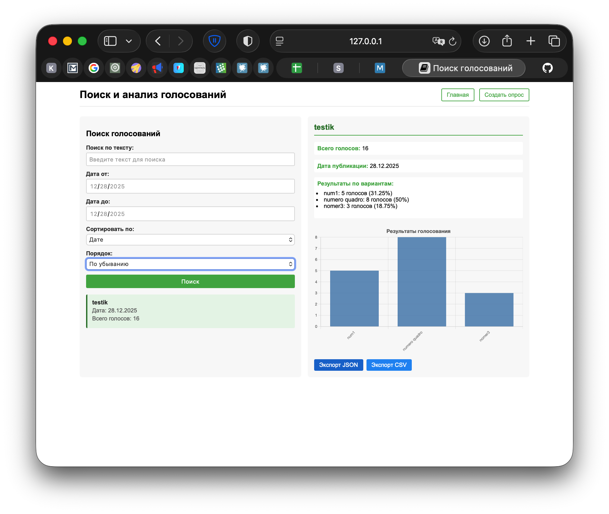
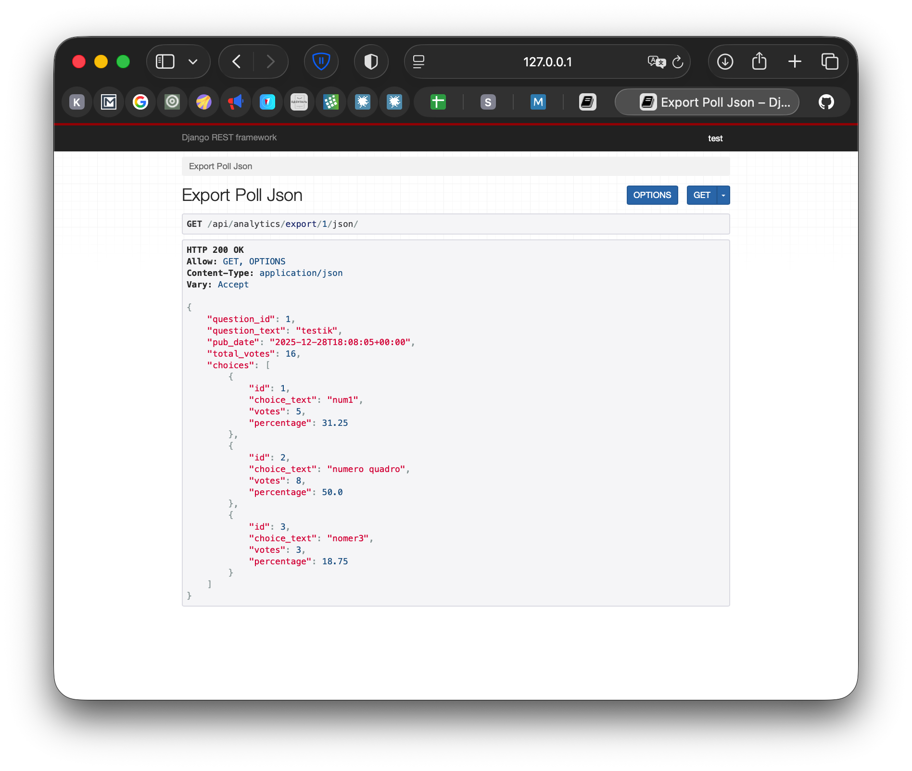
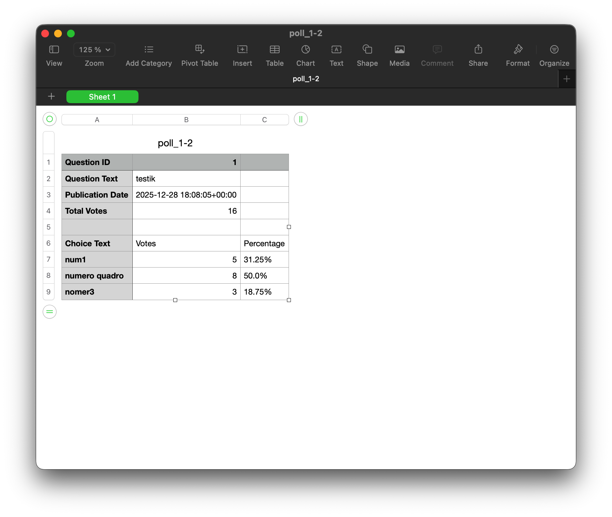

# Лабораторная работа №5. Django REST Framework: микросервисы

## Пальчук Герман, ИВТ 2.1

---

## Часть 2: Микросервисы для анализа голосований

### Выполнено:

1. Создано приложение `poll_analytics` с использованием Django REST Framework
2. Реализованы 4 микросервиса:
   - **Статистика по голосованиям** - агрегация данных о голосах, количество голосов на каждый вариант, процентное соотношение
   - **Диаграммы и графики** - визуализация результатов голосований (реализовано на клиенте с Chart.js)
   - **Экспорт данных** - экспорт результатов в форматах CSV и JSON
   - **Поиск и фильтрация** - поиск голосований по датам, тексту, сортировка по различным параметрам
3. Создана страница поиска `/polls/search/` с динамическим отображением статистики и диаграмм

### API Endpoints:

- `GET /api/analytics/statistics/<question_id>/` - статистика по конкретному голосованию
- `GET /api/analytics/statistics/overall/` - общая статистика по всем голосованиям
- `GET /api/analytics/charts/<question_id>/` - диаграмма результатов (matplotlib, base64 PNG/SVG)
- `GET /api/analytics/export/<question_id>/json/` - экспорт данных в JSON
- `GET /api/analytics/export/<question_id>/csv/` - экспорт данных в CSV
- `GET /api/analytics/search/` - поиск и фильтрация голосований

---

## Итог выполнения лабораторной работы №5:

### Часть 2 (микросервисы):
1. Создано приложение `poll_analytics` с Django REST Framework
2. Реализованы 4 микросервиса: статистика, диаграммы (Chart.js на клиенте), экспорт (CSV/JSON), поиск и фильтрация
3. Создана страница поиска `/polls/search/` с динамическим отображением статистики и диаграмм
4. Все микросервисы протестированы и работают корректно

## Скриншоты:
1. Страница статистики:

2. json-формат:

3. csv-формат:

