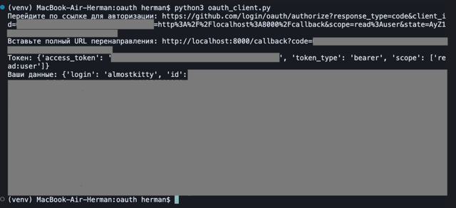

# Задание 1. Реализация Authorization Code Flow
Изменения: 
- Добавлена библиотека dotenv;
- Создан файл .env;

Результат:
- Зарегистрировано OAuth приложение в провайдере GitHub;
- Данные внесены в файл .env;
- Результат выполнения кода на рисунке 1;

# Задание 2. Обновление токена (refresh token)
Провайдер GitHub не поддерживает refresh token. Access token не имеет срока действия
и действителен до момента отзыва.
Поэтому механизм обновления токена для GitHub OAuth отсутствует.