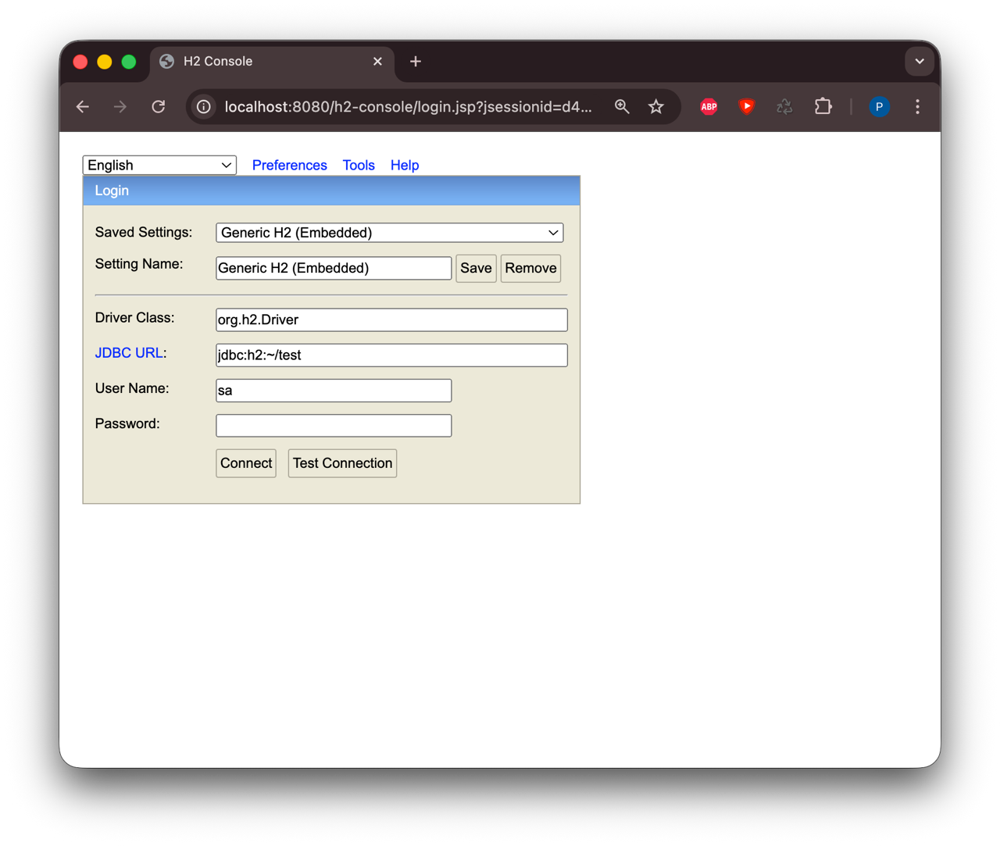
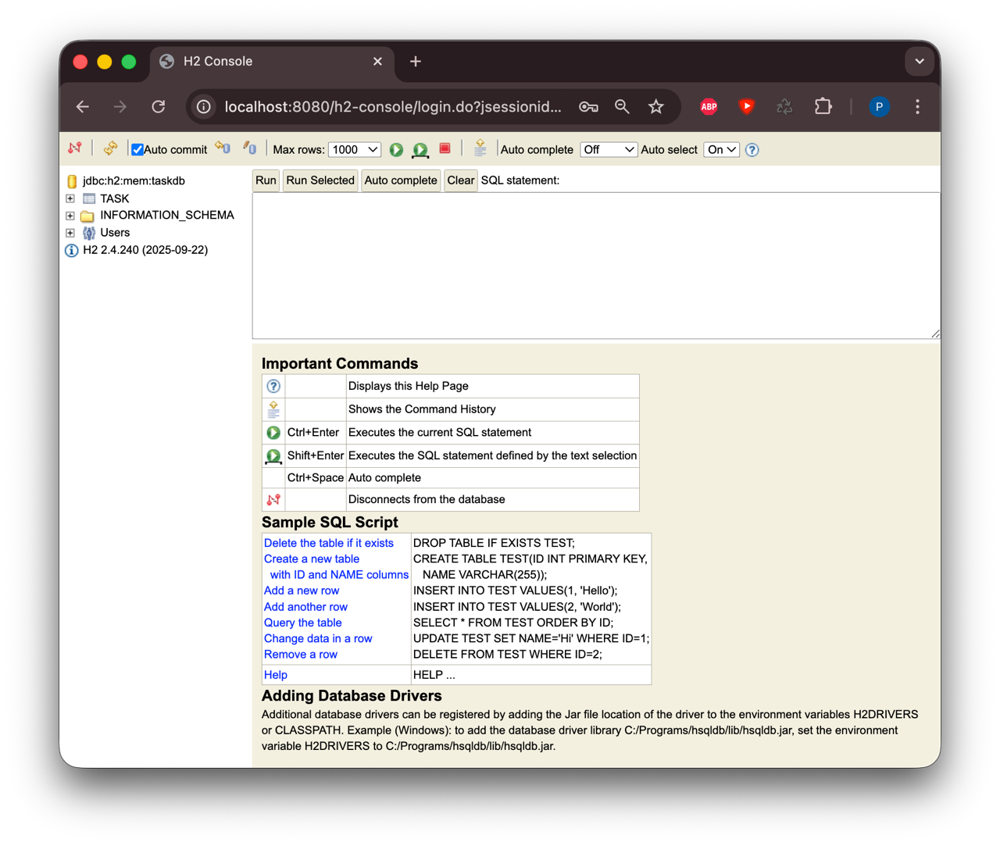
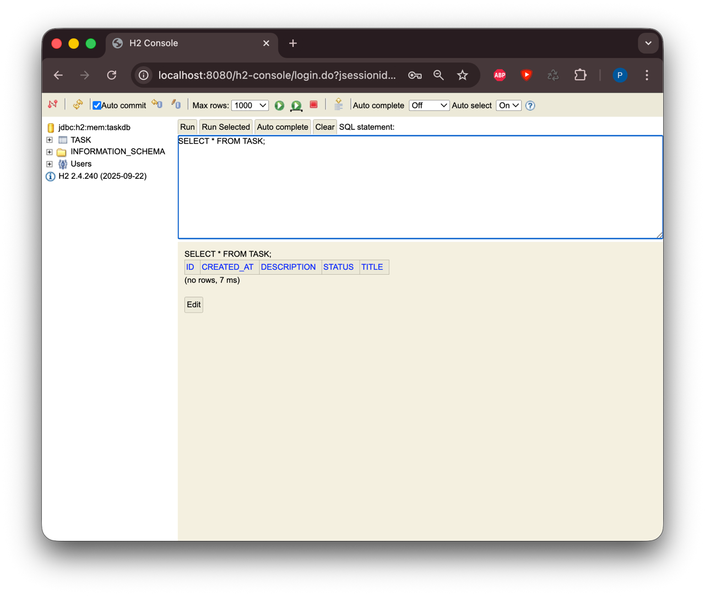
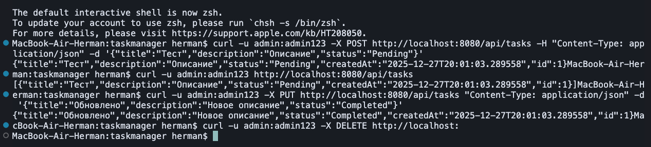

# Отчет по практической работе RESTful веб-приложение на Spring Boot

## Пальчук Герман, ИВТ 2.1

## Тестирование приложения
 
Фома подключения

H2 Console в браузере

SQL-запрос 

Тестирование через curl – Создание задачи, Получение всех задач, Обновление задачи, Удаление задачи

## Результат работы
- Модель Task — есть
- Репозиторий TaskRepository — есть
- Контроллер TaskController — есть
- Исключение ResourceNotFoundException — есть
- application.yaml — настроен
- Приложение запускается без ошибок
- Все CRUD операции работают через curl
- H2 Console открывается
