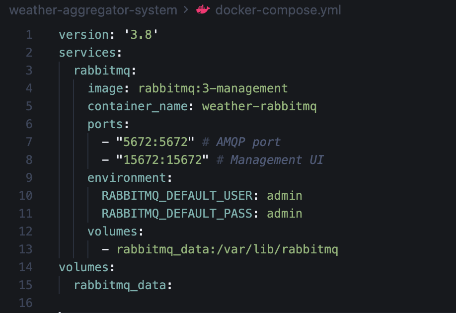
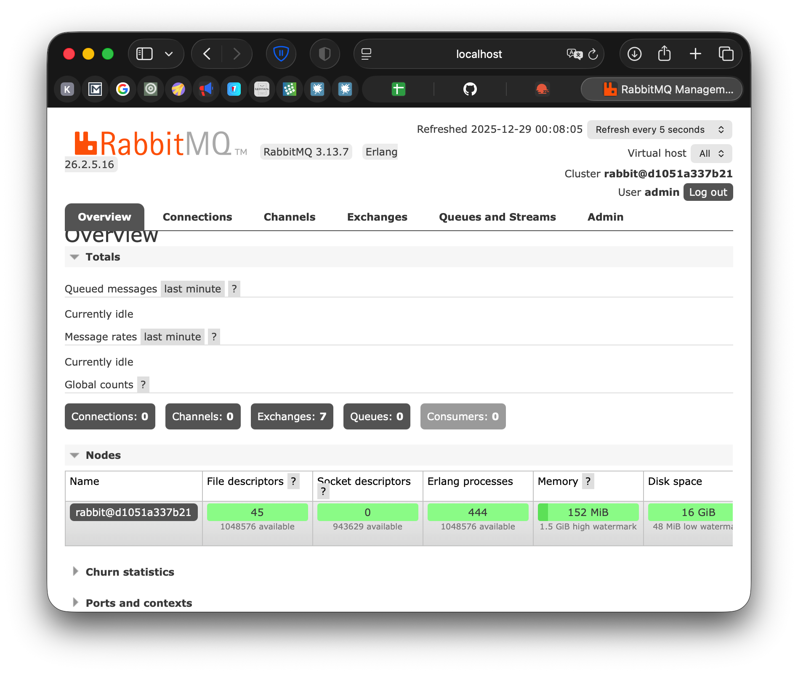
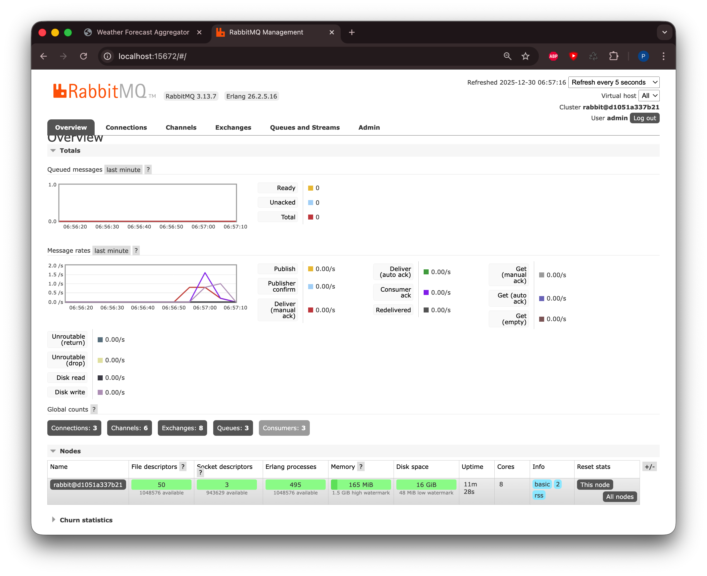
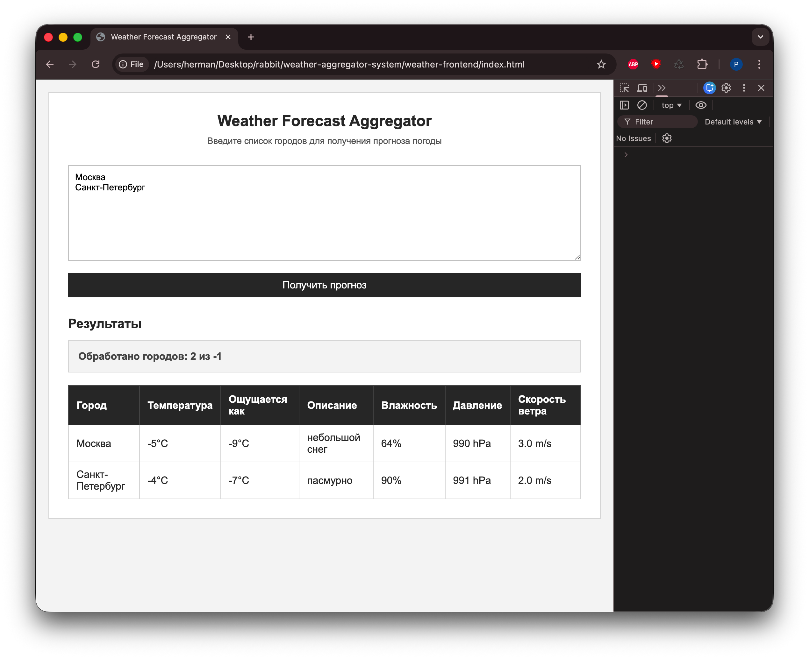

# Weather Aggregator System
## Пальчук Герман, ИВТ 2.1

Распределенная система агрегации прогнозов погоды с использованием Spring Boot и RabbitMQ.

## Структура проекта

- `weather-api-service/` - Сервис для получения данных о погоде из внешних API
- `weather-consumer-service/` - Сервис-потребитель сообщений из RabbitMQ
- `weather-aggregator-service/` - Сервис агрегации данных о погоде
- `weather-frontend/` - Frontend приложение

## Доступ к сервисам

- **Weather API Service**: http://localhost:8080
- **Weather Consumer Service**: http://localhost:8081
- **Weather Aggregator Service**: http://localhost:8082
- **RabbitMQ Management UI**: http://localhost:15672
- **Фронтенд** по адресу `weather-frontend/index.html`

## Скриншоты
- Docker Compose конфигурация:

- RabbitMQ Management UI:

- Frontend интерфейс:
