# Руководство пользователя
## Введение
Данное руководство предназначено для пользователей конфигурации 1С для ветеринарной клиники.   
В документе описаны доступные роли (**Администратор**, **Покупка**, **Продажа**), а также функционал каждой из них.  
Здесь вы найдете инструкции по работе с основными разделами программы и ответы на часто задаваемые вопросы (FAQ).

## Оглавление
- [Вход в программу](#вход-в-программу)
- [Руководство для администратора. Полный функционал](#руководство-для-администратора-полный-функционал)
  - [Раздел "Покупка"](#раздел-покупка)
    - [Лекарственные средства](#лекарственные-средства)
    - [Поступление лекарств](#поступление-лекарств)
    - [Производство комплектация](#производство-комплектация)
    - [Цены на лекарства](#цены-на-лекарства)
    - [Отчёты](#отчёты)
  - [Раздел "Продажа"](#раздел-продажа)
    - [Амбулаторный приём](#амбулаторный-приём)
    - [Документы клиентов](#документы-клиентов)
    - [Лекарственные средства](#лекарственные-средства-1)
    - [Пациенты](#пациенты)
    - [Продажа лекарств](#продажа-лекарств)
    - [Процедура](#процедура)
    - [Уровни клиентов](#уровни-клиентов)
    - [Условия рассрочки](#условия-рассрочки)
    - [Характеристики лекарств](#характеристики-лекарств-1)
    - [Цены на лекарства](#цены-на-лекарства-1)
    - [Отчеты](#отчеты-1)
    - [Сервис](#сервис)
  - [Раздел «Прочее»](#раздел-прочее)
- [Руководство пользователя](#руководство-пользователя)
  - [Роль Покупка](#роль-покупка)
    - [Добавление нового лекарственного средства](#добавление-нового-лекарственного-средства)
    - [Изменение лекарственного средства](#изменение-лекарственного-средства)
    - [Поступление лекарств](#поступление-лекарств-1)
    - [Новое поступление лекарств](#новое-поступление-лекарств)
    - [Цены на лекарства](#цены-на-лекарства-2)
    - [Изменение цены лекарства](#изменение-цены-лекарства)
    - [Формирование отчетов](#формирование-отчетов)
    - [Печать отчетов](#печать-отчетов)
    - [Просмотр истории](#просмотр-истории)
    - [Завершение работы](#завершение-работы)
  - [Роль Продажа](#роль-продажа)
    - [Добавление амбулаторного приема](#добавление-амбулаторного-приема)
    - [Печать и сохранение](#печать-и-сохранение)
    - [Изменение амбулаторного приема](#изменение-амбулаторного-приема)
    - [Работа с документами клиентов, лекарствами, пациентами](#работа-с-документами-клиентов-лекарствами-пациентами)
    - [Продажа лекарств](#продажа-лекарств-1)
    - [Процедуры, уровни клиентов, рассрочка, характеристики, цены](#процедуры-уровни-клиентов-рассрочка-характеристики-цены)
    - [Формирование и печать отчётов](#формирование-и-печать-отчётов)
    - [Просмотр истории и завершение работы](#просмотр-истории-и-завершение-работы)
- [FAQ](#faq)

---
## Вход в программу
При запуске программы открывается окно выбора **Роли**. Выбор осуществляется через выпадающий список. Доступны следующие роли: **Админ**, **Покупка**, **Продажа**. Ниже расположено поле ввода пароля.

Далее рассмотрим функционал каждой роли отдельно.

---
# Руководство для администратора. Полный функционал

Администратору доступен полный функционал программы. Он может работать с разделами: **Покупка**, **Продажа**, **Прочее**.

После входа открывается **Главное меню**. В верхней панели находятся четыре раздела: **Главное**, **Покупка**, **Продажа**, **Прочее**. Ещё выше расположены разделы **Уведомления**, **История** и кнопка выхода из программы.

---

### Раздел "Покупка"
Вкладка **Покупка** содержит следующие разделы:
- **Лекарственные средства**
- **Поступление лекарств**
- **Цены на лекарства**
- Кнопка **Отчёты**
#### Лекарственные средства
Доступна таблица с описанием товара, его кодом и ценой. Существующие записи можно редактировать. Для добавления нового нажмите **Создать**. При создании нового лекарства или редактировании существующего можно добавить файл картинки.
#### Поступление лекарств
Содержит список поступлений. Чтобы просмотреть подробности, двойным кликом выберите нужное поступление. Отобразится информация: номер поступления, дата, название препарата, количество, цена и сумма.
#### Производство комплектация 
Документ, хранящий информацию о сырье и продукции, которая производится из данного сырья. Сырье и продукция хранятся в определенных единицах измерения, при учете все переводится в граммы.
#### Цены на лекарства
Доступна таблица с текущими ценами на товары.
#### Отчёты
При нажатии кнопки **Отчёты** доступны пункты **Остатки лекарств** и **Остатки номенклатуры отчет**. В открывшемся окне можно сгенерировать отчёт с информацией об остатках препаратов и отчет с информацией об остатках номенклатуры.

---

### Раздел «Продажа»

Вкладка **Продажа** содержит следующие разделы:
- Амбулаторный приём
- Документы клиентов
- Лекарственные средства
- Пациенты
- Продажа лекарств
- Производство комплектация
- Процедура
- Уровни клиентов
- Условия рассрочки
- Характеристики лекарств
- Цены на лекарства

#### Амбулаторный приём
Таблица с информацией о приёмах: дата, номер, клиент, процедура, дата следующего приёма, жалобы, стоимость, скидка, итоговая стоимость, рассрочка. Записи можно редактировать и добавлять новые.
#### Документы клиентов
Содержит описание документов о продаже лекарств клиентам.
#### Лекарственные средства
Доступна таблица с описанием товара, его кодом и ценой. Существующие записи можно редактировать. Для добавления нового нажмите **Создать**. При создании нового лекарства или редактировании существующего можно добавить файл картинки.
#### Пациенты
Таблица с данными пациентов: ФИО, код, дата рождения, вид животного, кличка, уровень клиента. Записи можно редактировать или добавлять новые.
#### Производство комплектация 
Документ, хранящий информацию о сырье и продукции, которая производится из данного сырья. Сырье и продукция хранятся в определенных единицах измерения, при учете все переводится в граммы.
#### Продажа лекарств
Раздел содержит информацию о продажах.
#### Процедура
Таблица с перечнем процедур: название, код, стоимость.
#### Уровни клиентов
Список из 4 уровней, которые можно присваивать клиентам.
#### Условия рассрочки
Доступны оптовая и розничная рассрочка. Для каждой указаны процент и срок.
#### Характеристики лекарств
Таблица с описательными характеристиками лекарств: форма выпуска, размер упаковки и др.
#### Цены на лекарства
Таблица с информацией о ценах.
#### Отчеты
Позволяет формировать отчёты **Продажи лекарств** (информация о клиентах, купленных препаратах, количестве и сумме) и **Остатки номенклатуры отчет** (информация о номенклатуре и количестве остатоков)
#### Сервис
Позволяет добавить нового врача в систему через соответствующее окно.
### Раздел «Прочее»
Содержит разделы: **Документы клиентов**, **Единицы измерения**, **Значение характеристик**, **Значения свойств лекарств**, **Номенклатура** ,**Свойства лекарств**, **Характеристики лекарств** и кнопку **Сервис**.

---
# Руководство пользователя
## Роль Покупка
### Добавление нового лекарственного средства
Перейдите во вкладку **Лекарственные средства**, нажмите **Создать**, укажите название товара, цену и код (опционально), затем нажмите **Записать и закрыть**.
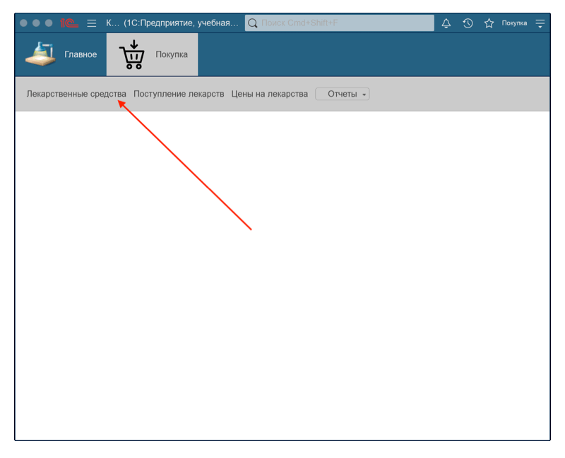
### Изменение лекарственного средства
Вкладка **Лекарственные средства**, двойной клик по нужной записи, внесите изменения и нажмите **Записать и закрыть**.
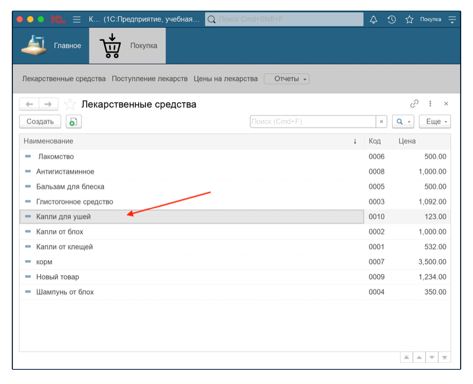
### Поступление лекарств
Вкладка **Поступление лекарств**, двойной клик по поступлению позволяет просмотреть подробности.
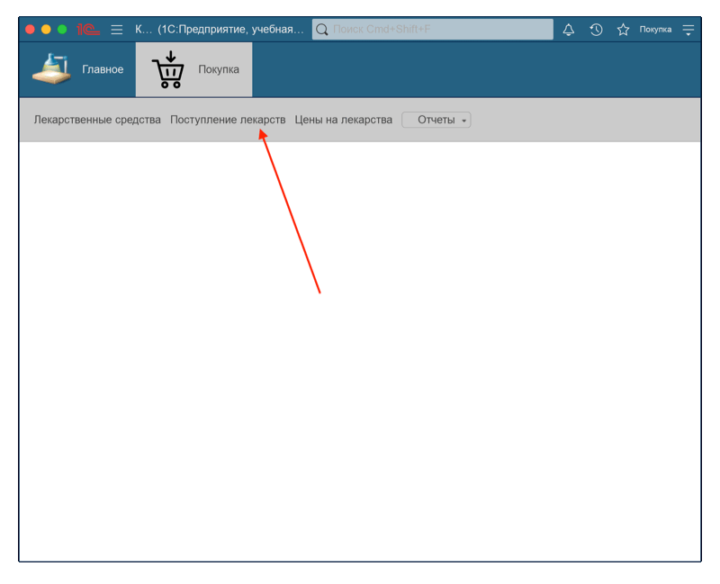
### Новое поступление лекарств
Вкладка **Поступление лекарств**, нажмите **Создать**, укажите номер и дату поступления. Используйте кнопку **Добавить**, затем **Показать все**, выберите препарат и нажмите **Выбрать**. Для добавления дополнительных препаратов повторите шаги. После заполнения нажмите **Провести и закрыть**.

### Цены на лекарства
Вкладка **Цены на лекарства**, двойной клик по препарату для просмотра деталей.

### Изменение цены лекарства
Нажмите **Создать**, укажите период и цену, выберите препарат через **Показать все** → **Выбрать**, затем нажмите **Записать и закрыть**.

### Формирование отчетов
Кнопка **Отчёты** → **Остатки лекарств**, нажмите **Сформировать** для генерации таблицы.
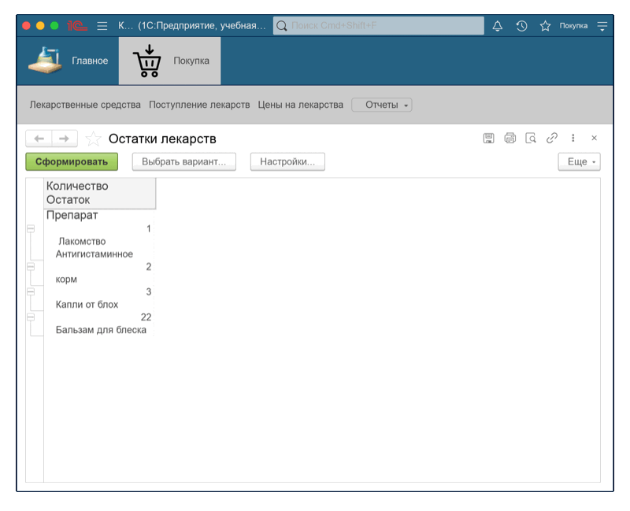
### Печать отчетов
Для сохранения или печати отчетов необходимо сначала их сформировать (см. раздел **Формирование отчетов**). После формирования доступны кнопки **Сохранить**, **Печать** и **Предварительный просмотр**. Выберите нужное действие.
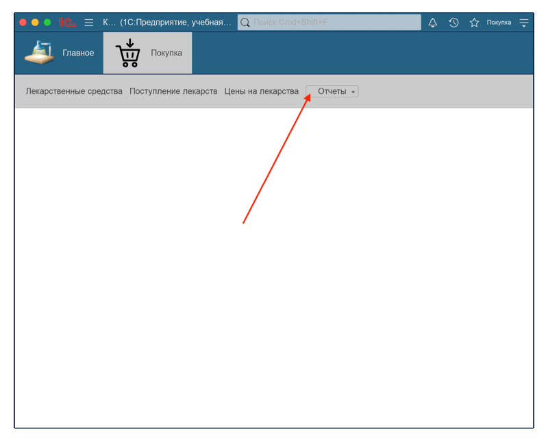
### Просмотр истории
Для просмотра истории, нажмите на кнопку с часами, расположенную в верхнем правом углу. Откроется окно, где можно посмотреть последние действия. Указан тип действия, время и дата. Для того, чтобы закрыть историю, нажмите на крестик справа от поля поиска.

### Завершение работы
Для завершения работы выберите **Покупка** → **Завершить работу (Выйти)**.
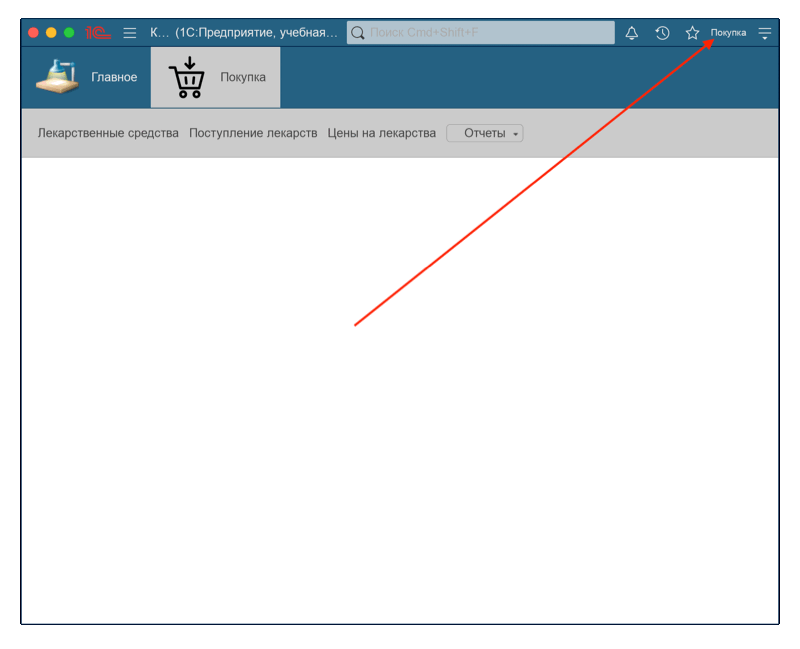

---
## Роль Продажа
### Добавление амбулаторного приема
Вкладка **Амбулаторный приём**, нажмите **Создать**, укажите дату, номер, стоимость, скидку, жалобы, дату следующего приёма. Добавьте клиента через **Показать все** или **Создать**. Заполните поля **Процедура** и **Рассрочка**, затем нажмите **Провести и закрыть**.
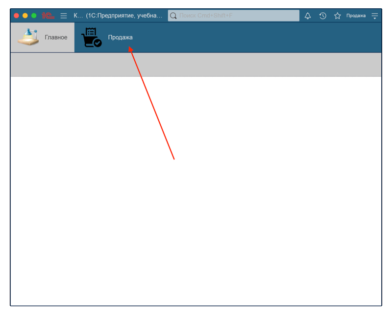
### Печать и сохранение
Для печати: выберите запись, нажмите **Печать**, затем иконку принтера.  
Для сохранения: выберите запись, нажмите **Печать**, затем иконку сохранения.

### Изменение амбулаторного приёма
Двойной клик по записи, внесите изменения и нажмите **Провести и закрыть**.
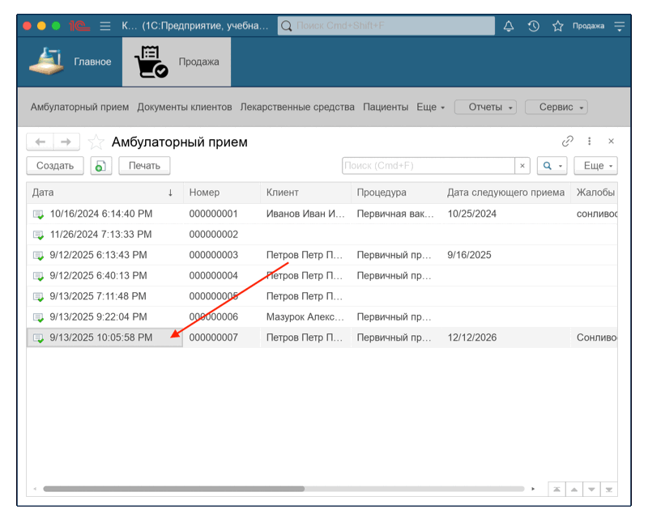
### Работа с документами клиентов, лекарствами, пациентами
Создание новых записей через вкладку → **Создать** → заполнение полей → **Записать и закрыть**.  
Изменение существующих записей через двойной клик → редактирование → **Записать и закрыть**.
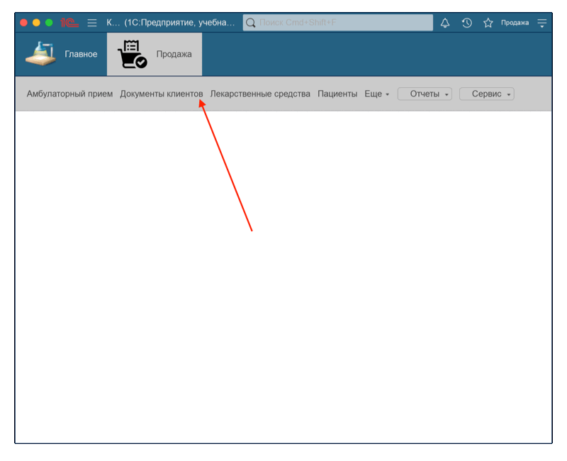
### Продажа лекарств
Вкладка **Продажа лекарств**, нажмите **Создать**, заполните поля с клиентом, датой и номером продажи. Добавьте препараты через кнопку **Добавить** и заполните поля, затем нажмите **Записать**.
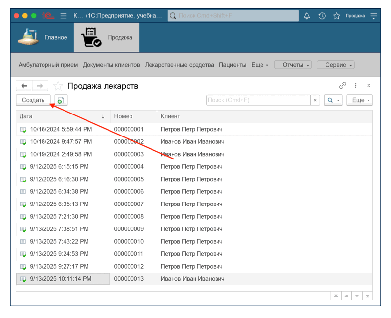
### Процедуры, уровни клиентов, рассрочка, характеристики, цены
Создание новых записей через вкладку → **Создать** → заполнение → **Записать и закрыть**.  
Изменение существующих через двойной клик → редактирование → **Записать и закрыть**.
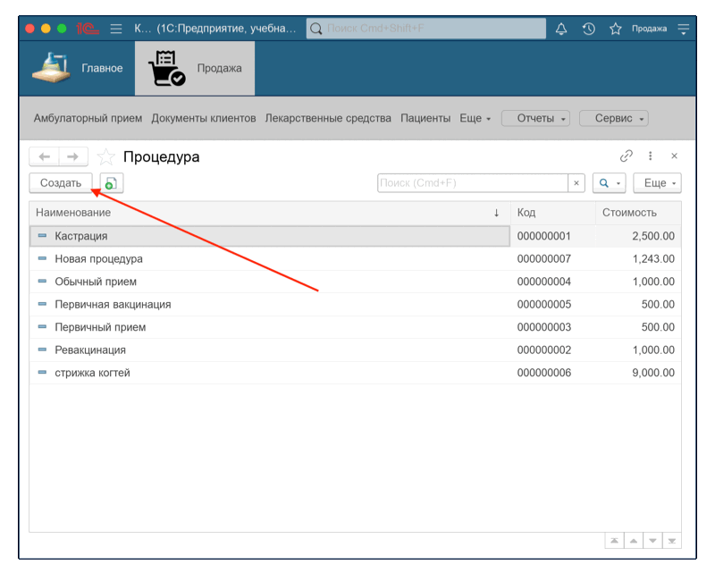
### Формирование и печать отчётов
Кнопка **Отчёты** → **Продажи лекарств**, нажмите **Сформировать**. Для печати или сохранения используйте кнопки справа: **Сохранить**, **Печать**, **Предварительный просмотр**.

### Создание новой записи врача в сервисе
Кнопка **Сервис** → **Врач**, внесите данные и нажмите **Записать и закрыть**.
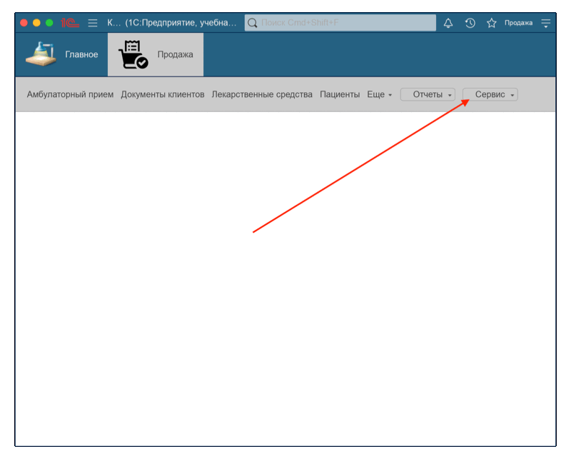
### Просмотр истории и завершение работы
Кнопка с часами → просмотр действий → закрыть крестиком.  
Завершение работы: **Продажа** → **Завершить работу (Выйти)**.

---
# FAQ
### Я не вижу описанные вкладки. Где их искать?
Иногда пользователи не видят все доступные вкладки. Для решения этой проблемы кнопка можно растянуть окно программы или открыть его в полноэкранном режиме. Также просмотреть не поместившиеся вкладки можно нажав на кнопку "Еще". 
### Я сделал ошибку в документе. Как её исправить?
Документ можно открыть двойным щелчком, внести изменения и нажать **Записать и закрыть**. Если документ уже проведён, используйте кнопку **Отмена проведения**, затем внесите исправления.
### Почему не отображаются новые записи в таблице?
Убедитесь, что запись была проведена и сохранена. Иногда требуется обновление вкладки или повторный вход в систему.
### Как добавить новый элемент в выпадающий список (например, процедуру или клиента)?
Используйте кнопку **Создать** в соответствующем разделе. После заполнения полей нажмите **Записать и закрыть**, новый элемент появится в списке.
### Почему отчёт не формируется или отображается пустым?
Проверьте выбранный период и фильтры. Убедитесь, что данные за этот период действительно существуют.

---

Руководство подготовил: **Пальчук Герман**