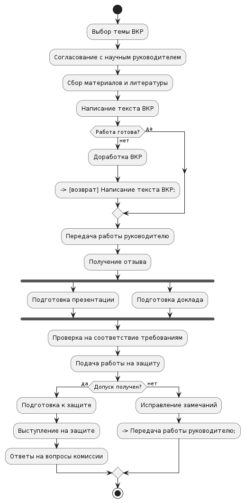

# Задание:
Создать диаграмму деятельности, отображающая процесс подготовки к защите ВКР, включающей подготовку работы и всех необходимых для защиты элементов (текст, отзыв руководителя, презентация, ...). Для построения использовать сервис draw.io или создать, используя Plant UML.

# Выполнение:
Диаграмма:



Код для построения диаграммы
```
@startuml
start

:Выбор темы ВКР;
:Согласование с научным руководителем;

:Сбор материалов и литературы;
:Написание текста ВКР;

if (Работа готова?) then (нет)
  :Доработка ВКР;
  --> [возврат] Написание текста ВКР;
else (да)
endif

:Передача работы руководителю;
:Получение отзыва;

fork
  :Подготовка презентации;
fork again
  :Подготовка доклада;
end fork

:Проверка на соответствие требованиям;
:Подача работы на защиту;

if (Допуск получен?) then (да)
  :Подготовка к защите;
  :Выступление на защите;
  :Ответы на вопросы комиссии;
else (нет)
  :Исправление замечаний;
  --> Передача работы руководителю;
endif

stop
@enduml
```