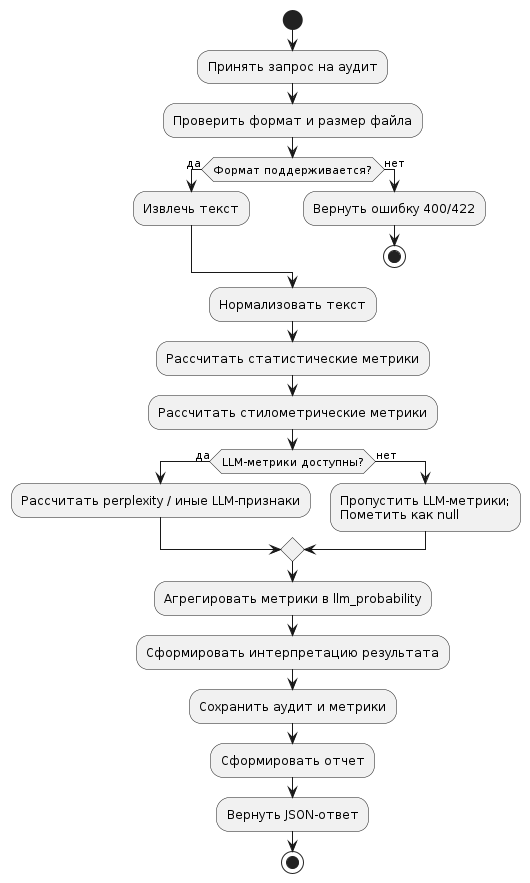

# Задание:
Создать диаграмму деятельности, отображающая процесс подготовки к защите ВКР, включающей подготовку работы и всех необходимых для защиты элементов (текст, отзыв руководителя, презентация, ...). Для построения использовать сервис draw.io или создать, используя Plant UML.

# Выполнение:
Диаграмма:





Код для построения диаграммы
```
@startuml
start

:Принять запрос на аудит;
:Проверить формат и размер файла;

if (Формат поддерживается?) then (да)
  :Извлечь текст;
else (нет)
  :Вернуть ошибку 400/422;
  stop
endif

:Нормализовать текст;
:Рассчитать статистические метрики;
:Рассчитать стилометрические метрики;

if (LLM-метрики доступны?) then (да)
  :Рассчитать perplexity / иные LLM-признаки;
else (нет)
  :Пропустить LLM-метрики;\nПометить как null;
endif

:Агрегировать метрики в llm_probability;
:Сформировать интерпретацию результата;
:Сохранить аудит и метрики;
:Сформировать отчет;
:Вернуть JSON-ответ;

stop
@enduml
```