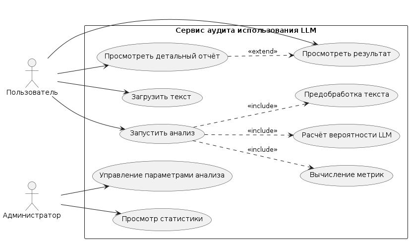
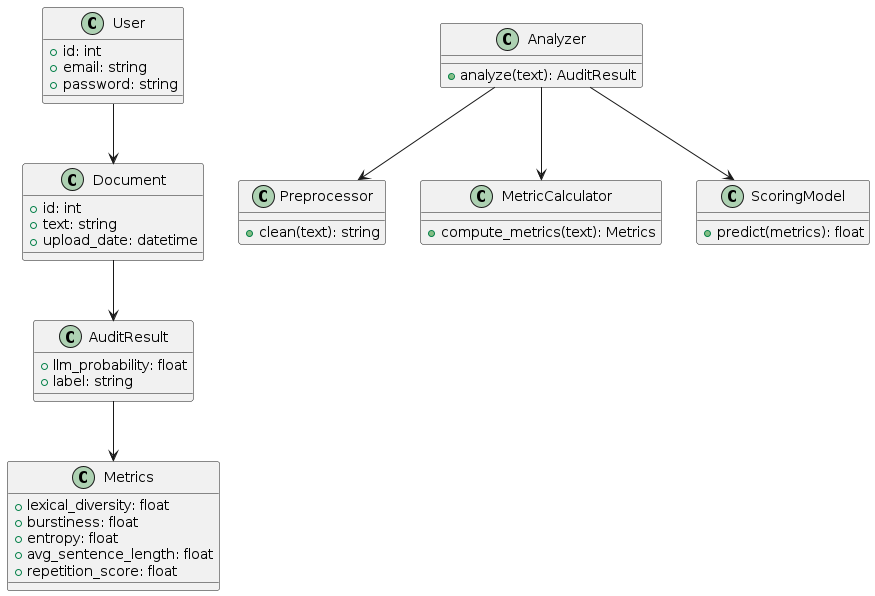
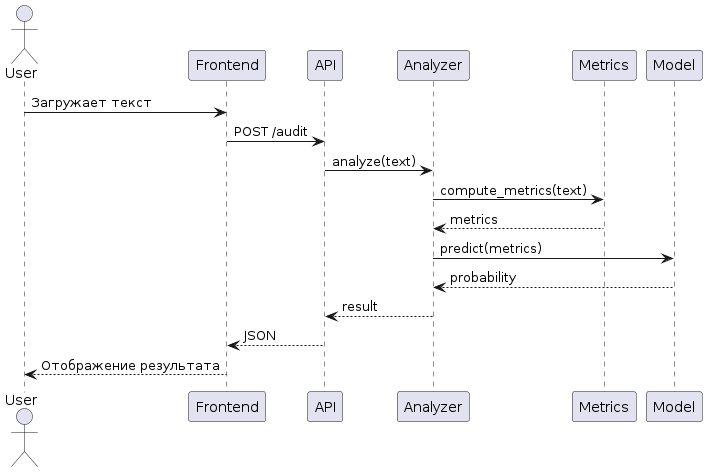
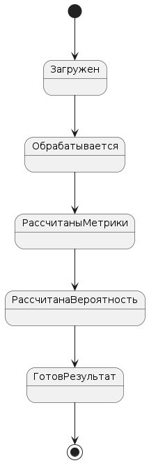

## 1. Диаграмма вариантов использования (Use Case)

```
@startuml
left to right direction

actor "Пользователь" as User
actor "Администратор" as Admin

rectangle "Сервис аудита LLM" {

  User --> (Загрузить текст)
  User --> (Запустить анализ)
  User --> (Просмотреть результат)
  User --> (Просмотреть детальный отчёт)

  Admin --> (Управление параметрами анализа)
  Admin --> (Просмотр статистики)

  (Запустить анализ) ..> (Предобработка текста) : <<include>>
  (Запустить анализ) ..> (Вычисление метрик) : <<include>>
  (Запустить анализ) ..> (Расчёт вероятности LLM) : <<include>>

  (Просмотреть детальный отчёт) ..> (Просмотреть результат) : <<extend>>
}

@enduml
```





## 2. Диаграмма классов (Class Diagram)

```
@startuml

class User {
  +id: int
  +email: string
  +password: string
}

class Document {
  +id: int
  +text: string
  +upload_date: datetime
}

class Metrics {
  +lexical_diversity: float
  +burstiness: float
  +entropy: float
  +avg_sentence_length: float
  +repetition_score: float
}

class AuditResult {
  +llm_probability: float
  +label: string
}

class Analyzer {
  +analyze(text): AuditResult
}

class Preprocessor {
  +clean(text): string
}

class MetricCalculator {
  +compute_metrics(text): Metrics
}

class ScoringModel {
  +predict(metrics): float
}

User --> Document
Document --> AuditResult
AuditResult --> Metrics

Analyzer --> Preprocessor
Analyzer --> MetricCalculator
Analyzer --> ScoringModel

@enduml
```





Код Python
``` python
class Metrics:
    def __init__(self, lexical_diversity, burstiness, entropy, avg_sentence_length, repetition_score):
        self.lexical_diversity = lexical_diversity
        self.burstiness = burstiness
        self.entropy = entropy
        self.avg_sentence_length = avg_sentence_length
        self.repetition_score = repetition_score


class AuditResult:
    def __init__(self, probability, label):
        self.llm_probability = probability
        self.label = label


class Preprocessor:
    def clean(self, text: str) -> str:
        return text.lower().strip()


class MetricCalculator:
    def compute_metrics(self, text: str) -> Metrics:
        # заглушка
        return Metrics(0.5, 3.0, 5.0, 10.0, 0.2)


class ScoringModel:
    def predict(self, metrics: Metrics) -> float:
        return 0.7


class Analyzer:
    def __init__(self):
        self.preprocessor = Preprocessor()
        self.calculator = MetricCalculator()
        self.model = ScoringModel()

    def analyze(self, text: str) -> AuditResult:
        clean_text = self.preprocessor.clean(text)
        metrics = self.calculator.compute_metrics(clean_text)
        probability = self.model.predict(metrics)

        label = "LLM" if probability > 0.5 else "Human"
        return AuditResult(probability, label)
```


## 3. Диаграмма последовательности (Sequence)

```
@startuml

actor User
participant "Frontend" as FE
participant "API" as API
participant "Analyzer" as Analyzer
participant "Metrics" as Metrics
participant "Model" as Model

User -> FE : Загружает текст
FE -> API : POST /audit
API -> Analyzer : analyze(text)

Analyzer -> Metrics : compute_metrics(text)
Metrics --> Analyzer : metrics

Analyzer -> Model : predict(metrics)
Model --> Analyzer : probability

Analyzer --> API : result
API --> FE : JSON
FE --> User : Отображение результата

@enduml
```





## 4. Диаграмма состояний (State)

```
@startuml

[*] --> Загружен

Загружен --> Обрабатывается
Обрабатывается --> РассчитаныМетрики
РассчитаныМетрики --> РассчитанаВероятность
РассчитанаВероятность --> ГотовРезультат

ГотовРезультат --> [*]

@enduml
```





## 5. Диаграмма деятельности (Activity)

```
@startuml
start

:Загрузка текста пользователем;

:Предобработка текста;

:Вычисление метрик;

:Расчёт вероятности LLM;

if (Вероятность > 0.5?) then (да)
  :Классификация как LLM;
else (нет)
  :Классификация как Human;
endif

:Формирование отчёта;

:Отображение результата пользователю;

stop
@enduml
```


