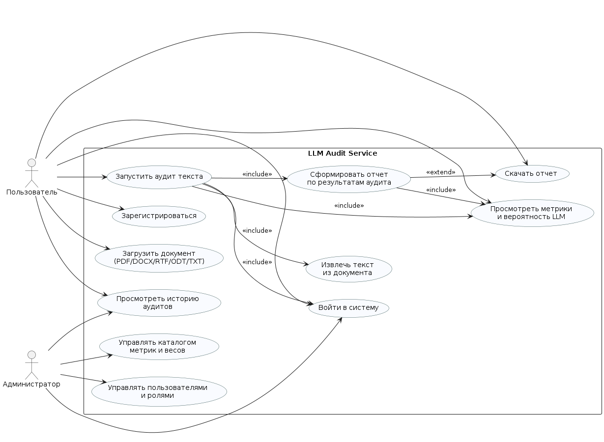
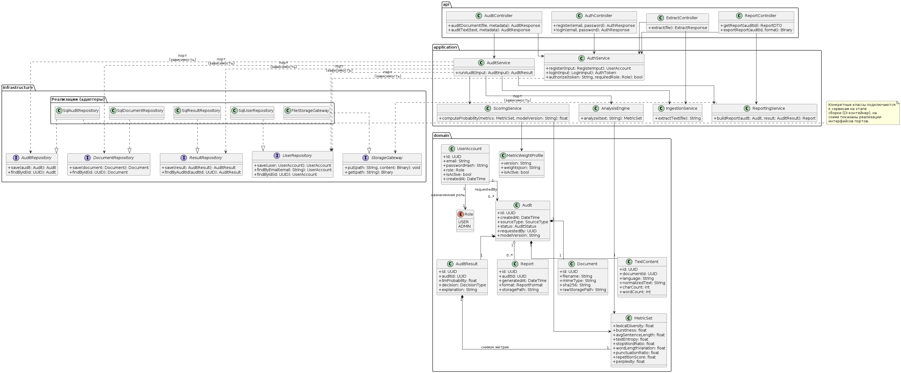
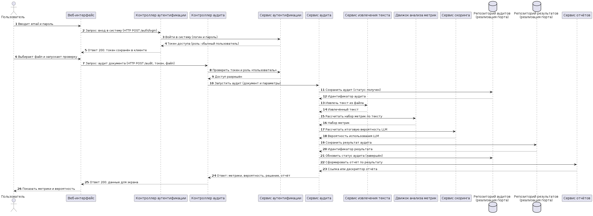
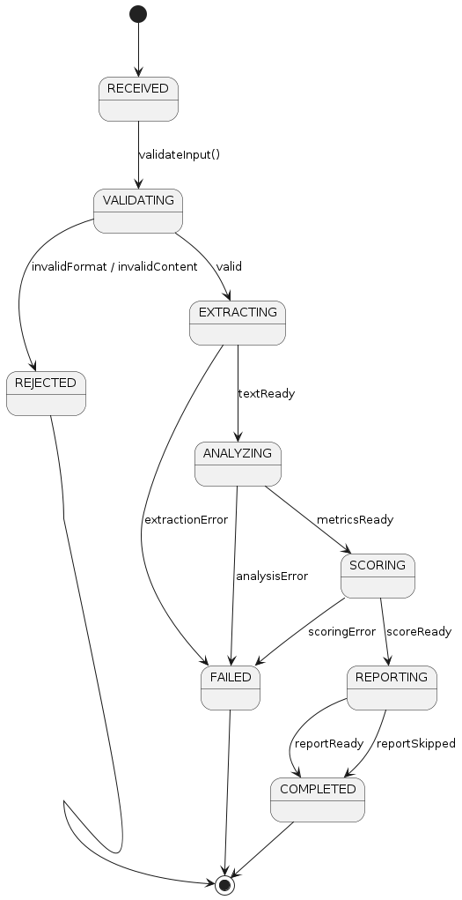

# 0. Кратко о предметной области и подходе

**Предметная область:** аудит происхождения профессиональных текстов (human vs LLM) с вероятностной интерпретацией результата и формированием отчета.

**Подход:**
- многоформатная загрузка документа;
- извлечение/нормализация текста;
- расчет набора статистических, стилометрических и LLM-ориентированных признаков;
- агрегация признаков в итоговую вероятность;
- хранение аудита, версионирование моделей и метрик;
- интерфейсы для аналитика, администратора и интеграций.

# 1. Диаграмма вариантов использования (Use Case)

```
@startuml
left to right direction
skinparam packageStyle rectangle
skinparam usecase {
  BackgroundColor #F9FBFF
  BorderColor #2F4F4F
}

actor "Пользователь" as User
actor "Администратор" as Admin

rectangle "LLM Audit Service" {
  usecase "Зарегистрироваться" as UC_Register
  usecase "Войти в систему" as UC_Login
  usecase "Загрузить документ\n(PDF/DOCX/RTF/ODT/TXT)" as UC_Upload
  usecase "Извлечь текст\nиз документа" as UC_Extract
  usecase "Запустить аудит текста" as UC_Audit
  usecase "Просмотреть метрики\nи вероятность LLM" as UC_ViewResult
  usecase "Сформировать отчет\nпо результатам аудита" as UC_Report
  usecase "Скачать отчет" as UC_Download
  usecase "Управлять каталогом\nметрик и весов" as UC_Weights
  usecase "Управлять пользователями\nи ролями" as UC_Users
  usecase "Просмотреть историю\nаудитов" as UC_History
}

User --> UC_Register
User --> UC_Login
User --> UC_Upload
User --> UC_Audit
User --> UC_ViewResult
User --> UC_Download
User --> UC_History


Admin --> UC_Login
Admin --> UC_Weights
Admin --> UC_Users
Admin --> UC_History

UC_Audit --> UC_Login : <<include>>
UC_Audit --> UC_Extract : <<include>>
UC_Audit --> UC_ViewResult : <<include>>
UC_Audit --> UC_Report : <<include>>
UC_Report --> UC_ViewResult : <<include>>
UC_Report --> UC_Download : <<extend>>
@enduml
```





## 2. Диаграмма классов (Class Diagram)

```
@startuml
skinparam classAttributeIconSize 0
skinparam linetype ortho

package "api" {
  class AuthController {
    +register(email, password): AuthResponse
    +login(email, password): AuthResponse
  }
  class AuditController {
    +auditDocument(file, metadata): AuditResponse
    +auditText(text, metadata): AuditResponse
  }
  class ExtractController {
    +extract(file): ExtractResponse
  }
  class ReportController {
    +getReport(auditId): ReportDTO
    +exportReport(auditId, format): Binary
  }
}

package "application" {
  class AuthService {
    +register(input: RegisterInput): UserAccount
    +login(input: LoginInput): AuthToken
    +authorize(token: String, requiredRole: Role): bool
  }
  class AuditService {
    +runAudit(input: AuditInput): AuditResult
  }
  class IngestionService {
    +extractText(file): String
  }
  class AnalysisEngine {
    +analyze(text: String): MetricSet
  }
  class ScoringService {
    +computeProbability(metrics: MetricSet, modelVersion: String): float
  }
  class ReportingService {
    +buildReport(audit: Audit, result: AuditResult): Report
  }
}

package "domain" {
  class Audit {
    +id: UUID
    +createdAt: DateTime
    +sourceType: SourceType
    +status: AuditStatus
    +requestedBy: UUID
    +modelVersion: String
  }
  together {
    class UserAccount {
      +id: UUID
      +email: String
      +passwordHash: String
      +role: Role
      +isActive: bool
      +createdAt: DateTime
    }
    enum Role {
      USER
      ADMIN
    }
  }

  UserAccount "1" --> "1" Role : назначенная роль

  class Document {
    +id: UUID
    +filename: String
    +mimeType: String
    +sha256: String
    +rawStoragePath: String
  }
  class TextContent {
    +id: UUID
    +documentId: UUID
    +language: String
    +normalizedText: String
    +charCount: int
    +wordCount: int
  }
  class MetricSet {
    +lexicalDiversity: float
    +burstiness: float
    +avgSentenceLength: float
    +textEntropy: float
    +stopWordRatio: float
    +wordLengthVariation: float
    +punctuationRatio: float
    +repetitionScore: float
    +perplexity: float
  }
  class AuditResult {
    +id: UUID
    +auditId: UUID
    +llmProbability: float
    +decision: DecisionType
    +explanation: String
  }
  class Report {
    +id: UUID
    +auditId: UUID
    +generatedAt: DateTime
    +format: ReportFormat
    +storagePath: String
  }
  class MetricWeightProfile {
    +version: String
    +weightsJson: String
    +isActive: bool
  }
}

package "infrastructure" {
  interface UserRepository {
    +save(user: UserAccount): UserAccount
    +findByEmail(email: String): UserAccount
    +findById(id: UUID): UserAccount
  }
  interface DocumentRepository {
    +save(document: Document): Document
    +findById(id: UUID): Document
  }
  interface AuditRepository {
    +save(audit: Audit): Audit
    +findById(id: UUID): Audit
  }
  interface ResultRepository {
    +save(result: AuditResult): AuditResult
    +findByAuditId(auditId: UUID): AuditResult
  }
  interface StorageGateway {
    +put(path: String, content: Binary): void
    +get(path: String): Binary
  }

  package "Реализации (адаптеры)" as impl {
    class SqlUserRepository
    class SqlDocumentRepository
    class SqlAuditRepository
    class SqlResultRepository
    class FileStorageGateway
  }

  SqlUserRepository ..|> UserRepository
  SqlDocumentRepository ..|> DocumentRepository
  SqlAuditRepository ..|> AuditRepository
  SqlResultRepository ..|> ResultRepository
  FileStorageGateway ..|> StorageGateway
}

AuthController --> AuthService
AuditController --> AuditService
ExtractController --> IngestionService
ReportController --> ReportingService

AuditController --> AuthService
ReportController --> AuthService
ExtractController --> AuthService

AuthService ..> UserRepository : порт\n(зависимость)

AuditService --> IngestionService
AuditService --> AnalysisEngine
AuditService --> ScoringService
AuditService --> ReportingService

AnalysisEngine --> MetricSet
ScoringService --> MetricSet
ScoringService --> MetricWeightProfile

AuditService ..> AuditRepository : порт\n(зависимость)
AuditService ..> DocumentRepository : порт\n(зависимость)
AuditService ..> ResultRepository : порт\n(зависимость)
AuditService ..> UserRepository : порт\n(зависимость)
ReportingService ..> StorageGateway : порт\n(зависимость)

note right of SqlAuditRepository
  Конкретные классы подключаются
  к сервисам на этапе
  сборки (DI-контейнер), на
  схеме показаны реализации
  интерфейсов портов.
end note

UserAccount "1" --> "0..*" Audit : requestedBy
Audit "1" *-- "1" Document
Audit "1" *-- "1" TextContent
Audit "1" *-- "1" AuditResult
AuditResult "1" *-- "1" MetricSet : снимок метрик
Audit "1" o-- "0..*" Report
@enduml
```





## 3. Диаграмма последовательности (Sequence)

```
@startuml
autonumber
actor "Пользователь" as User
participant "Веб-интерфейс" as UI
participant "Контроллер аутентификации" as AC
participant "Контроллер аудита" as C
participant "Сервис аутентификации" as AS
participant "Сервис аудита" as S
participant "Сервис извлечения текста" as I
participant "Движок анализа метрик" as A
participant "Сервис скоринга" as Sc
database "Репозиторий аудитов\n(реализация порта)" as AR
database "Репозиторий результатов\n(реализация порта)" as RR
participant "Сервис отчётов" as R

User -> UI: Вводит email и пароль
UI -> AC: Запрос: вход в систему (HTTP POST /auth/login)
AC -> AS: Войти в систему (логин и пароль)
AS --> AC: Токен доступа (роль: обычный пользователь)
AC --> UI: Ответ 200: токен сохранён в клиенте

User -> UI: Выбирает файл и запускает проверку
UI -> C: Запрос: аудит документа (HTTP POST /audit, токен, файл)
C -> AS: Проверить токен и роль «пользователь»
AS --> C: Доступ разрешён
C -> S: Запустить аудит (документ и параметры)

S -> AR: Сохранить аудит (статус: получен)
AR --> S: Идентификатор аудита

S -> I: Извлечь текст из файла
I --> S: Извлечённый текст

S -> A: Рассчитать набор метрик по тексту
A --> S: Набор метрик

S -> Sc: Рассчитать итоговую вероятность LLM
Sc --> S: Вероятность использования LLM

S -> RR: Сохранить результат аудита
RR --> S: Идентификатор результата

S -> AR: Обновить статус аудита (завершён)
S -> R: Сформировать отчёт по результату
R --> S: Ссылка или дескриптор отчёта

S --> C: Ответ: метрики, вероятность, решение, отчёт
C --> UI: Ответ 200: данные для экрана
UI --> User: Показать метрики и вероятность
@enduml
```





## 4. Диаграмма состояний (State)

```
@startuml
[*] --> RECEIVED

RECEIVED --> VALIDATING : validateInput()
VALIDATING --> REJECTED : invalidFormat / invalidContent
VALIDATING --> EXTRACTING : valid

EXTRACTING --> FAILED : extractionError
EXTRACTING --> ANALYZING : textReady

ANALYZING --> FAILED : analysisError
ANALYZING --> SCORING : metricsReady

SCORING --> FAILED : scoringError
SCORING --> REPORTING : scoreReady

REPORTING --> COMPLETED : reportReady
REPORTING --> COMPLETED : reportSkipped

FAILED --> [*]
REJECTED --> [*]
COMPLETED --> [*]
@enduml
```





## 5. Диаграмма деятельности (Activity)

```
@startuml
start

:Принять запрос на аудит;
:Проверить формат и размер файла;

if (Формат поддерживается?) then (да)
  :Извлечь текст;
else (нет)
  :Вернуть ошибку 400/422;
  stop
endif

:Нормализовать текст;
:Рассчитать статистические метрики;
:Рассчитать стилометрические метрики;

if (LLM-метрики доступны?) then (да)
  :Рассчитать perplexity / иные LLM-признаки;
else (нет)
  :Пропустить LLM-метрики;\nПометить как null;
endif

:Агрегировать метрики в llm_probability;
:Сформировать интерпретацию результата;
:Сохранить аудит и метрики;
:Сформировать отчет;
:Вернуть JSON-ответ;

stop
@enduml
```


## 6. Сгенерированный код по диаграмме классов

```python
from dataclasses import dataclass
from datetime import datetime
from enum import Enum
from typing import Optional
from uuid import UUID


class SourceType(str, Enum):
    FILE = "file"
    API = "api"


class AuditStatus(str, Enum):
    RECEIVED = "RECEIVED"
    VALIDATING = "VALIDATING"
    EXTRACTING = "EXTRACTING"
    ANALYZING = "ANALYZING"
    SCORING = "SCORING"
    REPORTING = "REPORTING"
    COMPLETED = "COMPLETED"
    FAILED = "FAILED"
    REJECTED = "REJECTED"


class DecisionType(str, Enum):
    LOW = "LOW"
    MEDIUM = "MEDIUM"
    HIGH = "HIGH"


@dataclass
class Document:
    id: UUID
    filename: str
    mime_type: str
    sha256: str
    raw_storage_path: str


@dataclass
class TextContent:
    id: UUID
    document_id: UUID
    language: str
    normalized_text: str
    char_count: int
    word_count: int


@dataclass
class MetricSet:
    lexical_diversity: float
    burstiness: float
    avg_sentence_length: float
    text_entropy: float
    stop_word_ratio: float
    word_length_variation: float
    punctuation_ratio: float
    repetition_score: float
    perplexity: Optional[float] = None


@dataclass
class Audit:
    id: UUID
    created_at: datetime
    source_type: SourceType
    status: AuditStatus
    requested_by: str
    model_version: str


@dataclass
class AuditResult:
    id: UUID
    audit_id: UUID
    llm_probability: float
    decision: DecisionType
    explanation: str
    metrics: MetricSet


class IngestionService:
    def extract_text(self, file_bytes: bytes, filename: str) -> str:
        raise NotImplementedError


class AnalysisEngine:
    def analyze(self, text: str) -> MetricSet:
        raise NotImplementedError


class ScoringService:
    def compute_probability(self, metrics: MetricSet, model_version: str) -> float:
        raise NotImplementedError


class AuditService:
    def __init__(self, ingestion: IngestionService, analysis: AnalysisEngine, scoring: ScoringService):
        self.ingestion = ingestion
        self.analysis = analysis
        self.scoring = scoring

    def run_audit(self, file_bytes: bytes, filename: str, model_version: str) -> AuditResult:
        text = self.ingestion.extract_text(file_bytes, filename)
        metrics = self.analysis.analyze(text)
        probability = self.scoring.compute_probability(metrics, model_version)
        # mapping probability -> decision/explanation omitted
        raise NotImplementedError
```