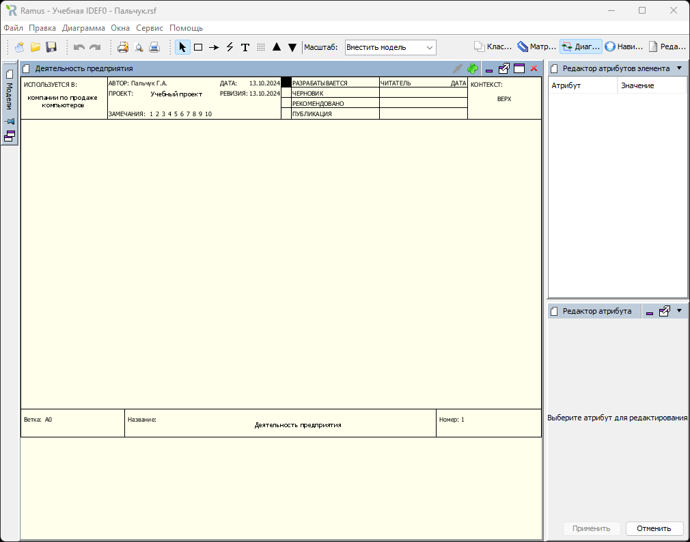
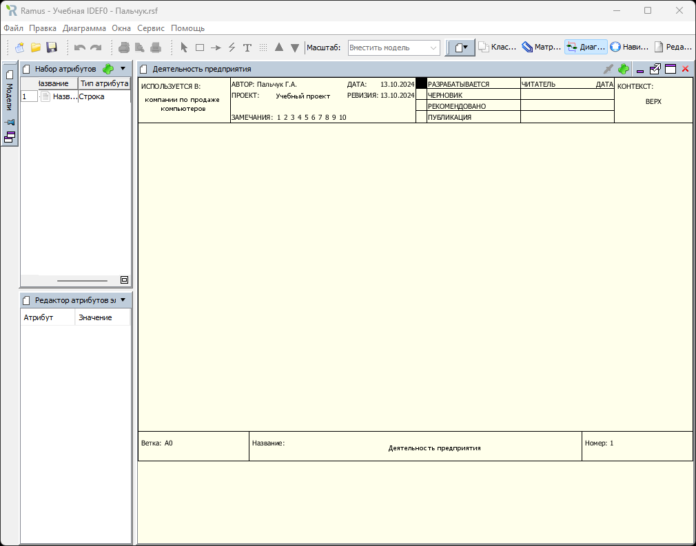
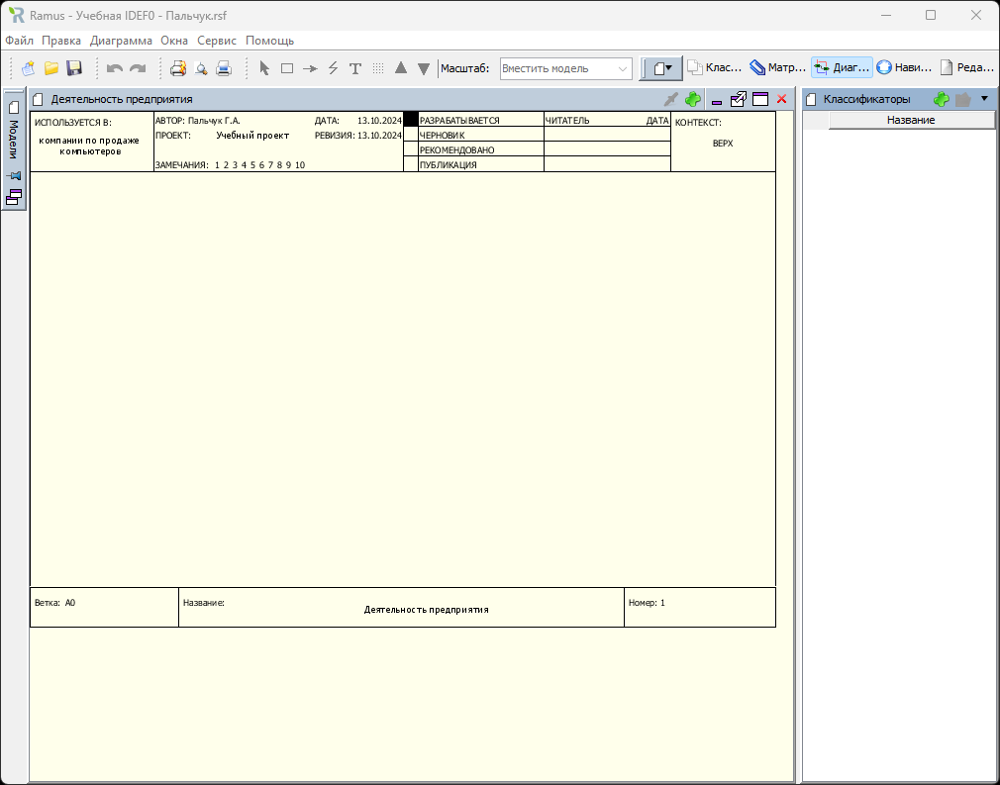
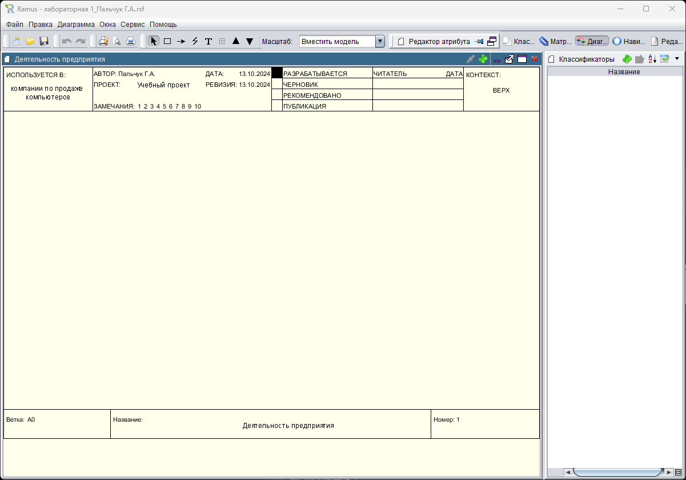

### Пальчук Герман Андреевич, ИВТ 2.1

## Лабораторная работа №1 «Интерфейс и настройка программы Ramus Educational»

#### Ход выполнения:

- Задания 1-14:

- Задание 15.5:

- Задание 15.6:

- Задание 15.7:

.png)

- Задание 17:
