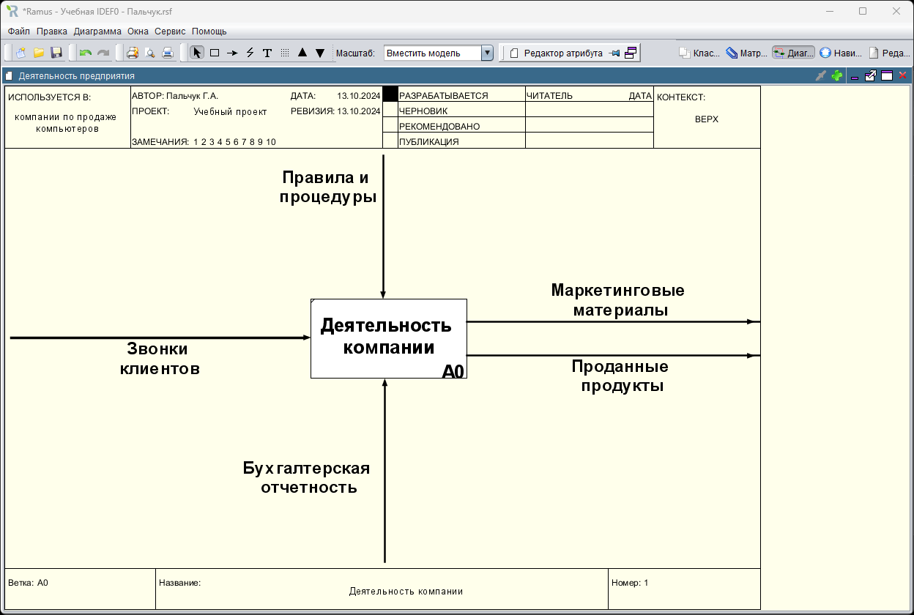
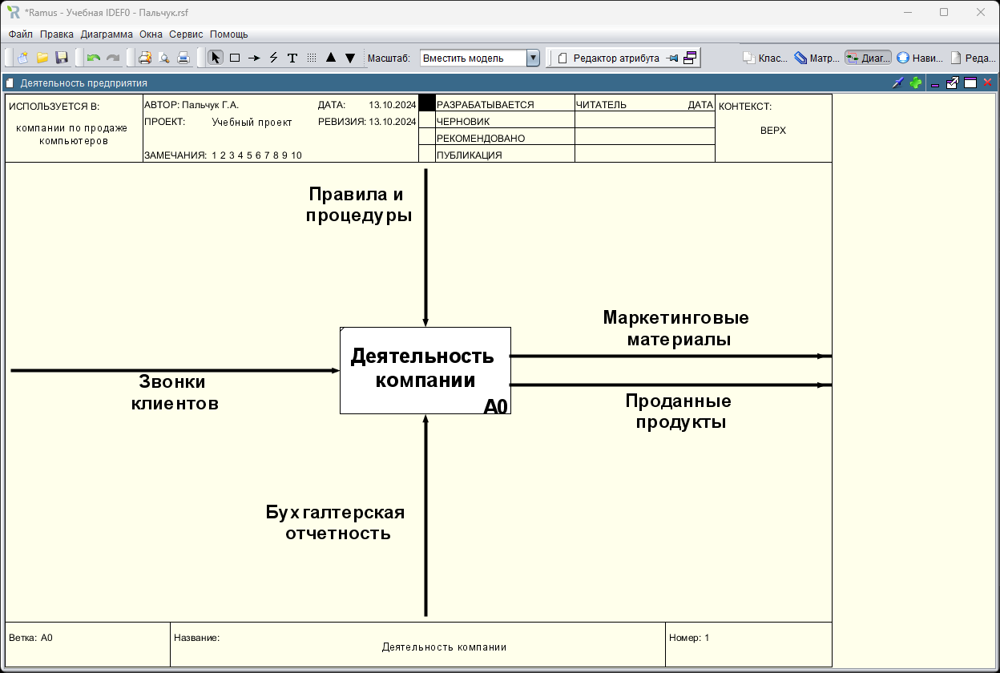
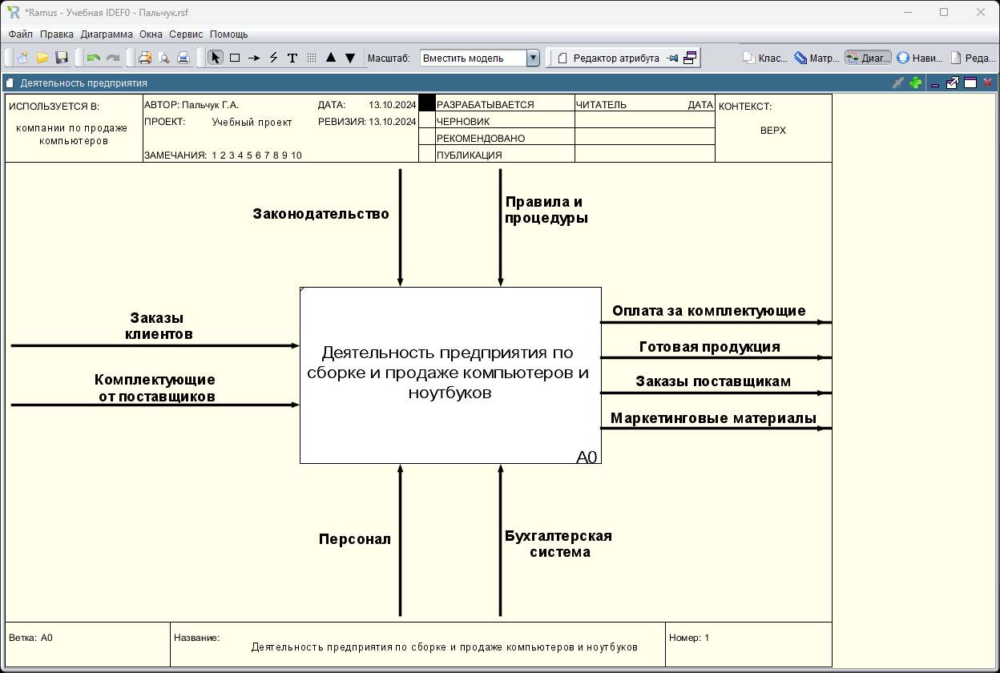
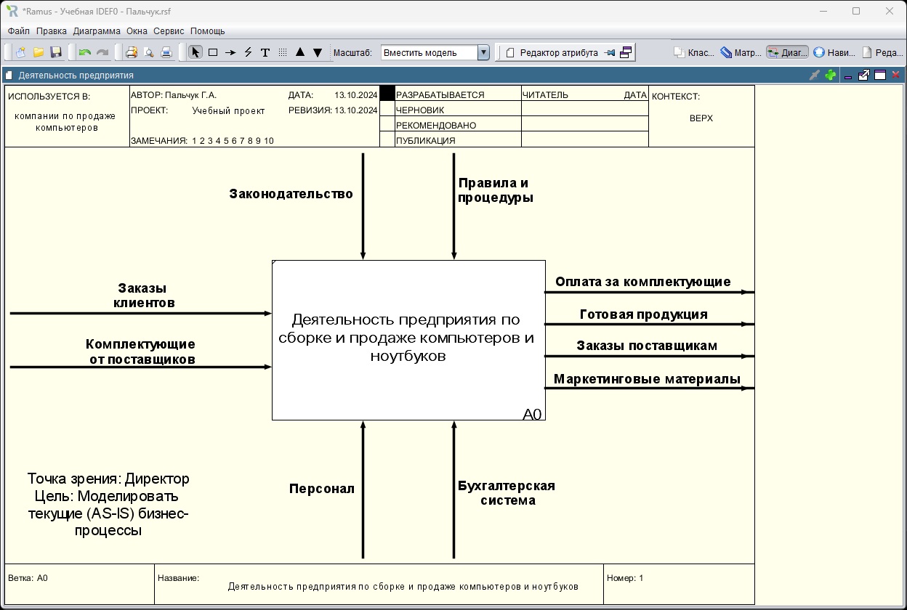

### Пальчук Герман Андреевич, ИВТ 2.1

## Лабораторная работа №2 «Создание модели в программе Ramus Educational»

#### Ход выполнения:

- Построение контекстной диаграммы:

- Часть 2:

- Часть 2. Центрование:

- Задание 3 – Самостоятельно постройте контекстную диаграмму "Деятельность предприятия по сборке и продаже компьютеров и ноутбуков":

- Задание 4 – Добавьте текст в поле диаграммы:
